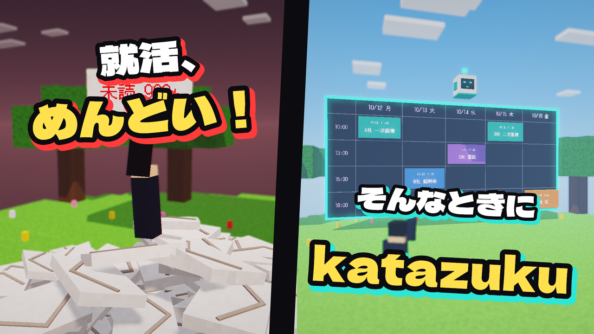
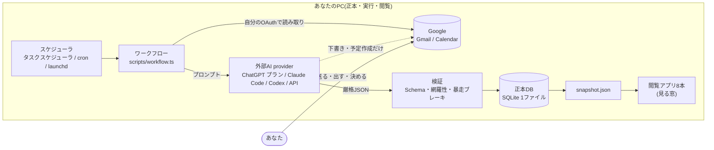

# katazuku-shukatsu

**就活の「めんどい」を、あなたのPCの中で片づける。**
メールの見張り・予定の登録・提出物の追跡・面接の前夜準備を自動で回し、
「送る・出す・決める」だけをあなたに残す、オープンソースの就活オートパイロットです。

**現在はターミナル操作とGoogle Cloudの設定が必要な開発版です。**
認証なしのデモで画面を試せます。自分のデータで使う場合は、接続確認と定期実行の登録まで必要です。

[](https://github.com/kokotatan/katazuku-shukatsu/actions/workflows/ci.yml)
[](https://www.npmjs.com/package/katazuku-shukatsu)
[](./LICENSE)



紹介動画(準備中): 公開したらここにリンクを置きます。

[English](#english) / [デモで試す](#デモで試す資格情報ゼロ) / [セットアップ](docs/SETUP.md) / [AIプロバイダ](docs/AI-PROVIDERS.md) / [参加方法](CONTRIBUTING.md)

---

## あなたはどちら?

| 使いたい人(ターミナル操作あり) | 開発に参加したい人 |
|---|---|
| 1. [デモ](#デモで試す資格情報ゼロ)で画面を見る(アカウント接続なし) | 1. [CONTRIBUTING.md](CONTRIBUTING.md) を読む |
| 2. [docs/SETUP.md](docs/SETUP.md) の順に、Google と AI をつなぐ | 2. [docs/ARCHITECTURE.md](docs/ARCHITECTURE.md) で全体像をつかむ |
| 3. 毎日のワークフローを登録して、朝のまとめを待つ | 3. [最初の貢献ガイド](docs/FIRST-CONTRIBUTION.md) から課題を選んで参加する |

ボタンだけで始められる**無料のデスクトップアプリ**(ローカル動作・オープンソース)を
準備中です([docs/DESKTOP-APP.md](docs/DESKTOP-APP.md))。

AIの利用料は、**あなた自身の** ChatGPT プラン(Sign in with ChatGPT)・Claude Code・Codex、または API キーで払います。
katazuku 側のサーバや課金はありません。正本DBとローカルの閲覧データは、あなたのPCに保存します。
Googleとの通信や、選択したAIプロバイダへの情報送信は発生します。AIへ渡す情報は各ワークフローの `--dry-run` と [AIプロバイダ](docs/AI-PROVIDERS.md) で確認できます。

## 何ができるか

| 機能 | 中身 | AI | つなぐもの |
|---|---|---|---|
| メール見張り(毎時) | 未読を見張り、面接案内・結果・提出依頼など緊急なものだけ返信**下書き**・カレンダー登録・通知 | ツールを使えるAI(Claude Code / Codex) | Gmail・カレンダー |
| 毎朝の選考同期 | メールを読み取り専用で取得 → AIが選考の動きを構造化 → 検証してから正本DBへ反映 | どれでも(ChatGPT プラン / API キーも可) | Gmail |
| きょうやること(毎朝) | 本人がやることを**最大3件**に。送り忘れの下書き・締切の作業ブロック(時刻入り)・故障報告 | ツールを使えるAI | Gmail・カレンダー |
| 前夜ブリーフ(毎晩) | 明日の面接の相手・前回の記録・想定問答をまとめる。予定が無い日はAIを呼ばない | ツールを使えるAI | Gmail |
| カレンダー同期(30分) | カレンダー → 正本DB。空き判定は「空き / 重複 / 不明」で、情報不足を空きと扱わない | 不要(判断が要る予定だけAI) | カレンダー |
| 提出物台帳 | 誓約書・証明書・ES などを成果物1件ずつ追跡し、完了するまで毎日再評価 | 不要 | — |
| 番犬(4時間) | 自動処理が止まっていないか・AIの利用枠が全滅していないかを見張る | 不要 | — |
| 閲覧アプリ8本 | きょう / 選考 / 企業 / メール / 人 / 面接準備 / プロフィール / 効果 | 不要 | — |
| 面談の録音(任意・Windows) | オンライン面談を相手の声つきで録る | 不要 | — |
| Gemini Spark 連携(任意) | スマホから予定・選考状況を聞く | 不要 | 自分の Cloudflare |

詳しい動きは [docs/WORKFLOWS.md](docs/WORKFLOWS.md)、AIの選び方は [docs/AI-PROVIDERS.md](docs/AI-PROVIDERS.md)。

## やらないこと(コードで止めている安全境界)

- **第三者へのメール送信はしない。** 返信は常に下書きまで。送るのはあなた。
- **ES・エントリー・フォームの送信、予約の確定、辞退はしない。** 提出物は「承認するだけ」の状態まで準備します。
- **Web適性検査・コーディングテストの代理受験はしない。**
- AIにデータベースを直接書かせない。AIの出力は形と網羅性を検証してから、決まった規則で反映します。

詳しくは [SECURITY.md](SECURITY.md)。

## しくみ



- **正本は1つ**(ローカルの SQLite)。アプリ・カレンダーは「見る窓」です。
- **書き手はエージェントだけ。** 状態は遷移規則(`transition()`)を必ず通して更新し、変化は台帳に残ります。
- **AIは取り替えられる。** 未ログイン・利用枠切れなど「何もしていない失敗」のときだけ、次のAIへ切り替えます。

<a id="5分で試す資格情報ゼロ"></a>

## デモで試す(資格情報ゼロ)

Node.js 22.13以降の22系、または24以降(推奨 24)が必要です。

```sh
git clone https://github.com/kokotatan/katazuku-shukatsu.git
cd katazuku-shukatsu
npm run demo
```

架空のデータでホーム画面がブラウザに開きます。8画面へ同じローカルURLから移動できます。
アカウント接続もAIも使いません。**初回は8画面の依存導入・ビルドがあるため数分〜十数分かかります。**
2回目からは既存ビルドを使い、ソースが変わった画面だけビルドし直します。パッケージ取得にはインターネットが必要です。
別のアプリから始めるなら `npm run demo -- insight`。ブラウザを自動で開かない場合は `--no-open`、
ポートが使用中なら `npm run demo -- --port 4174` を使います。停止は Ctrl+C。

デモは実データや正本DBを読みません。自分のデータを見るときはセットアップ後に `npm start` を実行します。
朝のまとめ・前夜の準備はホーム、成果物ごとの未完了提出物は「今日やること」から確認できます。

ほかに手元で試せること:

```sh
npm test                                 # 架空データで全部の規則を検証
npm run seed                             # 架空の正本DBを組み立てて表示
npm run workflow -- asa --dry-run        # 朝のまとめのプロンプトと、使うAIの順番を表示(外部に触れない)
```

## 自分のデータで使う

[docs/SETUP.md](docs/SETUP.md) の順に進めます。流れは次のとおりです。

1. `katazuku.config.json` を作る(アカウント・署名・通知の設定。gitignore 済み)
2. Google につなぐ: 自分のGoogle CloudでデスクトップOAuthクライアントを作り、`npm run google:connect` で本人が読取りを許可。下書き・予定の書込みには別のGoogle MCP接続も必要
3. AI を選ぶ: `npm run chatgpt -- signin`(ChatGPT プラン)、または Claude Code / Codex にログイン
4. `--dry-run` で確認してから、毎日のワークフローを登録する
5. `npm start` で8画面と朝・前夜のまとめを一つのローカルURLから開く

実利用の前提は `npm run doctor -- --setup` で確認できます。設定・Google資格情報・選択したAIのローカル準備を調べ、秘密値は表示しません。
通信やログインは行わないため、[Google接続ガイド](docs/GOOGLE-CONNECTION.md) の本人による読み取り確認も済ませてください。

開発者向けの[共通Google接続](docs/GOOGLE-WORKSPACE.md)も用意しています。
`npm run google:workspace:connect -- --account 自分のメールアドレス` で起動します。
権限審査は未完了で、一般利用向けの完成版ではありません。個別OAuthの `google:connect` と分けて試せます。

## AIプロバイダ

| 選び方 | 支払い | 向いている工程 |
|---|---|---|
| **ChatGPT プラン(Sign in with ChatGPT)** | あなたの ChatGPT プラン | 毎朝の選考同期など、ツール不要の工程(ツール対応は今後) |
| **Claude Code**(`claude-cli`) | あなたの Claude Code の契約 | すべて |
| **Codex**(`codex-cli`) | あなたの Codex の契約(ChatGPT アカウントでログイン可) | すべて |
| API キー(`anthropic-api` / `openai-api`) | 従量課金 | ツール不要の工程 |
| ローカルモデル(`codex-oss`) | 無料 | 読み物系だけ |

順番は `katazuku.config.json` の `agent.providerOrder` で決めます。詳しくは [docs/AI-PROVIDERS.md](docs/AI-PROVIDERS.md)。
katazuku は claude.ai のログインを実装していません(Anthropic の方針により、Claude のサブスクリプションはあなたがログインした Claude Code 経由で使います)。

## プライバシー

- データ(メール要約・予定・選考状況)はあなたのPCの SQLite にだけ保存します。メール本文は正本DBに保存しません。
- katazuku の作者のサーバは存在しません。AIへの通信は、あなたが選んだ provider とだけ行います。
- 秘密値は gitignore 済みの `.env`、または各CLI・OS側の保存場所に置きます。設定ファイルやコードに書きません。
- ログ(`logs/`)は個人データを含むため gitignore 済みで、古いものは自動で消します。

## よくある質問

**Q. 無料ですか?**
katazuku 自体は無料のオープンソース(Apache-2.0)です。AIの利用分は、あなたの ChatGPT / Claude / Codex の契約、または API キーの従量課金です。

**Q. 勝手にメールを送ったり、エントリーしたりしませんか?**
しません。無人のワークフローには第三者へ送る能力自体を渡していません。返信は下書き、提出は「承認するだけ」の状態までです。

**Q. Windows 以外でも動きますか?**
ワークフローは Node で書かれていて、Windows・macOS・Linux で動きます。定期実行は Windows ならタスクスケジューラ、
macOS / Linux なら `npm run schedule:print` が出す cron / launchd / systemd の設定を使います。録音スクリプトだけ Windows 専用です。

**Q. PCを閉じていたら?**
逃した実行は、PCが起きたあとに1回だけ走ります。数日止まっていた場合も、日次同期は前回成功した時点からのメールを拾い直します。

**Q. どのAIがいちばんおすすめ?**
全部の機能を使うなら、ツールを使える Claude Code か Codex です。ブラウザで許可するだけで始めたいなら ChatGPT プランから。

**Q. 自分の大学・業界向けに変えられますか?**
署名・対象アカウント・拾うメールの語・宣伝扱いにする送信元は、すべて `katazuku.config.json` で変えられます。

## 開発に参加する

小さな改善でも歓迎します。就活経験者の用語レビュー、macOS / Linux での動作確認、ドキュメントの修正も大歓迎です。

- 始め方: [CONTRIBUTING.md](CONTRIBUTING.md)
- 初参加の手順(日英): [最初の貢献ガイド](docs/FIRST-CONTRIBUTION.md)
- 募集中の初心者向け課題: [good first issue](https://github.com/kokotatan/katazuku-shukatsu/issues?q=is%3Aissue%20is%3Aopen%20label%3A%22good%20first%20issue%22)
- 設計: [docs/ARCHITECTURE.md](docs/ARCHITECTURE.md)
- AIアシスタントに聞くなら: [AGENTS.md](AGENTS.md) と [llms.txt](llms.txt) を読ませると、設計と作法をすぐ答えられます

```sh
npm install
npm run check    # 個人情報スキャン + 型検査 + ビルド + 全テスト(PRの前に必ず)
```

### リポジトリの地図

| 場所 | 中身 |
|---|---|
| `src/` | 正本DBとセマンティックレイヤー(遷移規則・名寄せ・冪等な反映)、応募の状態機械、AI実行契約、各種の決定論的な部品 |
| `scripts/` | ワークフロー(`workflow.ts`)とプロンプト(`*-prompt.md`)、取得・台帳・スナップショットのCLI、定期実行の登録 |
| `schemas/` | 入出力の JSON Schema(AIの抽出結果・設定ファイル・設定GUI) |
| `shared/` と `board/` ほか7本 | 閲覧アプリ群(SmartHR Design System 準拠・読み取り専用) |
| `tests/` | 依存ゼロの自前assertテスト(架空データだけ) |
| `cloudflare/` / `spark-gateway/` | 任意: 自分の Cloudflare へのセルフホスト、Gemini Spark 連携 |
| `docs/` | セットアップ・ワークフロー・AIプロバイダ・設計・ロードマップ |

### ライブラリとして使う

```sh
npm install katazuku-shukatsu
```

```ts
import { openDb, transition, resolveCompany, applyDiff } from 'katazuku-shukatsu'
```

公開APIの入口は `src/index.ts` だけです(SemVer はこの面にかかります)。ランタイム依存はゼロで、標準の `node:sqlite` を使います。

---

## English

**katazuku-shukatsu** is an open-source, local-first autopilot for Japanese new-graduate job hunting (*shūkatsu*).
It watches your inbox, drafts replies, keeps interviews and deadlines on your calendar, tracks every document you were
asked to submit, and prepares a briefing the night before each interview — while leaving every decision and every
external commitment (sending mail, submitting forms, declining offers) to you.

- **Development version.** Terminal commands and your own Google Cloud OAuth setup are currently required.
- **Two audiences.** Users: run the [fictional-data demo](#デモで試す資格情報ゼロ), then follow
  [docs/SETUP.md](docs/SETUP.md). A free desktop app is planned ([docs/DESKTOP-APP.md](docs/DESKTOP-APP.md)).
  Contributors: start with [Your first contribution](docs/FIRST-CONTRIBUTION.md#your-first-contribution).
  Documentation reviews, platform verification reports, and English issues or pull requests are welcome.
- **Bring your own AI.** Sign in with ChatGPT (your ChatGPT plan), your own Claude Code or Codex login, or an API key.
  katazuku has no server and no billing of its own. It never implements claude.ai login.
- **Safety boundaries are enforced in code.** Unattended workflows cannot email third parties (drafts only), never
  submit forms or take aptitude tests, and never let the model write to the database directly — model output is
  schema- and coverage-validated first.
- **Local-first.** One SQLite file on your machine is the source of truth; the eight read-only apps are views.

```sh
git clone https://github.com/kokotatan/katazuku-shukatsu.git
cd katazuku-shukatsu
npm run demo      # eight apps on one local URL; fictional data, no accounts, no AI
```

Requirements: Node.js 22.13+ in the 22.x line, or 24+ (24 recommended). Workflows run on Windows, macOS and Linux.
The first launch installs and builds all eight apps and may take several minutes. After setup, use `npm start`
to view your own data. The viewer binds to 127.0.0.1 and does not run workflows or change to demo data silently.

## License

[Apache-2.0](./LICENSE)

このプロジェクトは日本の新卒一括採用(プレエントリー・ES・Web適性・面接日程調整)という固有の流れを対象にしています。
実データ(氏名・企業・面接記録)はリポジトリに含めません。
