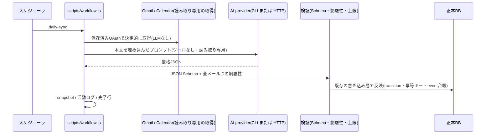

# アーキテクチャ

## 一言で

**エージェントが唯一の書き手である、監査可能な単一SQLite正本。**
就活のルーチンを自動運転しつつ、重要な決定と外部への確定操作は必ず本人に残す。

## データの流れ

```
メール / 会話 / 面接 / 提出結果 / カレンダー / 企業研究
        │  (書き手は agent だけ)
        ▼
  data/katazuku.db  ── 正本(ローカルSQLite・単一ファイル・WAL)
        │
        ├─→ 読み取り整形(listPlatformSnapshot 等)→ アプリ/画面(見る窓)
        └─→ 一方向ミラー(バックアップ・閲覧用)
```

- **正本は1つ**。画面・シート・カレンダーは「見る窓」で、そこを人が直接編集しても次のミラーで消える。
- **言語**: DB は SQLite、アクセスは Node 標準 `node:sqlite`、コードは TypeScript。ランタイム依存ゼロ。

## 中核の原則

1. **単一書き手(agent-only writer)**
   人・アプリは読み取りのみ。修正は会話でエージェントに依頼し、エージェントが DB に書く。
2. **上書きしない、遷移規則で更新する**
   状態変更は `transition()`(`src/db.ts`)の規則エンジンを必ず通す。
   終了系(不合格・辞退)は根拠があれば合格からでも確定・終了からの復活はしない・
   手書きの詳細ステータスを粗い進行中で潰さない・「辞退予定」は内定でも上書きしない。
3. **冪等キー + 監査イベント**
   外部由来の入力は `source_ref` / `external_id` などで冪等化(部分UNIQUE索引)。
   状態が変わる出来事は `event` 台帳に残し、「なぜ今この状態か」を後から追える。
4. **名寄せ(エンティティ解決)**
   企業名は正規化 + 学習済み別名(`company_alias`)で解決。怪しい一致は自動マージせず
   `pending_review` に積んで本人確認へ回す。
5. **安全境界はコードで強制**(注意書きではなく)
   ES・エントリーの送信は本人承認必須、Web適性検査の代理受験はしない([SECURITY.md](../SECURITY.md))。
6. **provider非依存の実行**
   Claude / Codex / ローカルモデルを、目的・capability・出力schema・承認点・完了条件で抽象化(`src/agent-runtime.ts`)。
   利用枠切れ・認証切れは、副作用を始めていないと確認できる場合だけ次providerへフォールバックする。

## 自動運転ワークフローとAIの位置づけ



- **取得と判断と反映を分ける。** 取得は決定的なスクリプト、判断だけAI、反映は検証を通った後の決まった関数。
  AIにSQLや正本DBの書き込みを任せないので、どのAIが抽出しても同じ規則が効く。
- **無人工程の能力は最小。** 工程ごとに渡す能力(capability)を決め、第三者への送信能力は無人工程に渡さない
  (本人宛の通知は `gmail.send.self` として分離)。
- **AIは `src/agent-runtime.ts` の実行契約で取り替える。** CLI型(Claude Code / Codex / ローカルモデル)は子プロセス、
  HTTP型(API キー / ChatGPT プラン)は `run()` で実行し、どちらも同じ結果の形・失敗分類・利用枠の休止を使う。
  切り替えは「副作用を始める前の失敗」だけ。
- **完了は完了行で判定する。** 終了コード0では成功とみなさず、失敗は `logs/alert-<name>.txt` に残して番犬と朝のまとめが拾う。

詳しくは [WORKFLOWS.md](WORKFLOWS.md) と [AI-PROVIDERS.md](AI-PROVIDERS.md)。

## 主なテーブル

- `company` / `company_alias` / `pending_review` — 企業と名寄せ
- `selection` / `event` — 選考トラックと、その状態変化の台帳
- `appointment` — 面接・締切・説明会(時刻・会議URL・場所・相手を構造化)
- `career_organization` / `career_meeting` — 応募先と混同しない就活支援組織・支援面談
- `submission_requirement` — 求められた提出物を成果物1件ずつ、完了するまで追う台帳
- `schedule_block` / `source_sync_state` — 空き判定用の予定投影と、外部取得の鮮度(情報不足を空きと誤認しない)
- 応募自動運転・移動・プロフィール等の専用テーブル(`src/application.ts` / `src/mobility.ts` / `src/platform.ts`)

## 運用上の前提

- **単一デバイス前提**。正本を複数デバイスで同時に書かない。移行・退避は `npm run backup`
  (`VACUUM INTO` で WAL を畳んだ1ファイル)経由で行う。
- 正本をクラウド同期フォルダ直下に置かない(WAL がネットワークFSで破損しうる)。
- 時刻はゼロ時差入力を Asia/Tokyo として正規化する(`normalizeAppointmentAt`)。

## 既知の課題

ブラウザ操作、OS資格情報ストア、工程ごとの再開台帳(workflow契約)、面談の議事録化は未実装です。
優先順と参加できる作業は[ROADMAP.md](../ROADMAP.md)を参照してください。
