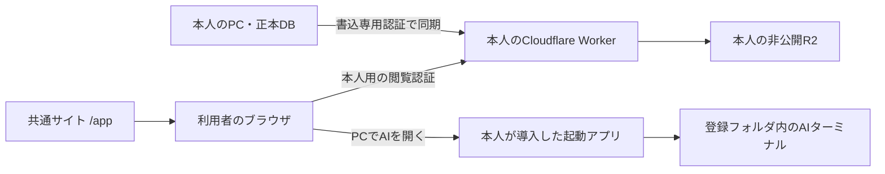

# 共通URL・各自の保存先・PCでのAI起動

2026-09-08。本人の要望を受けた実装方針。以下の共通ログインとPC起動連携は未実装。現在の個人GUIを多人数向けとして公開しない。

## 利用者の体験

1. `katazuku-shukatsu.kotalabo.com` で内容を知り、「使い始める」を選ぶ。
2. Cloudflareにログインし、自分のアカウントにkatazuku用の保存先を作ることを許可する。
3. PC用の起動アプリを入れ、保存フォルダと利用するAIを選ぶ。インストール済みのAIは自動検出し、未導入の場合は公式の導入手順へ案内する。
4. 普段は共通URLの `/app/` をPC・スマホで開き、企業研究・会った人・予定を見る。
5. PCでは「AIを開く」からClaude Code / Codex / Gemini CLIを選ぶと、登録済みのkatazukuフォルダでターミナルが開く。

利用者が独自ドメインを購入する必要はない。各自のAPIにはCloudflareの `workers.dev` を使える。ブラウザのアドレス欄は共通の `/app/` に保てる。初期段階ではサブドメインの有効化などCloudflare側で初回操作が必要になる可能性があるため、実アカウントで導入工程を検証する。

## データの置き場所

- 公開サイトは共通の画面を配信する。選考・メール・顔写真を配信アセットに含めない。
- 個人の正本DBは本人のPCに残し、閲覧用のデータと写真を本人のCloudflareアカウントへ送る。
- 共通の運営サーバーを個人データの読み出し代理にせず、ブラウザから本人のWorkerへ直接接続する。
- 「一つの運営DBに利用者IDを付ける方式」でも他利用者との分離はできるが、保存先は運営者の環境になる。今回の本人の意図には各自のCloudflare方式が合う。
- アカウントを共同管理するCloudflare管理者は、そのアカウントのリソースにアクセスできる場合がある。個人用アカウントを基本にする。
- 共通サイトの配信者は画面のJavaScriptを更新できるため、保存先を分けただけで「運営者が技術的に絶対読めない」とは言わない。配信コードも信頼しない利用者には、GUIも自分で配信するOSS方式を残す。

## Cloudflareログインと自動セットアップ

Cloudflareは第三者向けOAuthクライアントを提供しており、ブラウザ・デスクトップ・CLI向けにAuthorization Code + PKCE（S256）を案内している。ユーザー情報エンドポイントとOpenID設定も公開されている。ログイン認証、Cloudflareへの操作許可、個別データの閲覧許可は分けて実装する。

### 導入側

1. アプリ名・既存ロゴ・URL・最小スコープでOAuthクライアントを作る。まずprivateで検証する。
2. 本人管理のドメインをTXTで検証し、一般向け公開の準備をする。publicへの変更は元に戻せないため、検証・公開準備が揃った段階で行う。
3. OAuthはstate・PKCE・登録済みredirect URIを検証する。OpenIDのIDトークンを採用する場合はissuer・audience・nonce・署名・期限も検証する。認可コードやトークンをアクセスログに残さない。
4. 本人が選択したアカウントへの権限を確認し、専用Workerと非公開R2を作る。必要なスコープとAPIのCORS挙動は小さな検証環境で確認する。
5. 作成途中から再開できるようにリソースを照合する。既存バケットやWorkerを名前だけで上書きしない。

### 閲覧側

- 汎用Cloudflare管理トークンをそのままデータAPIの認証に流用しない。デプロイ権限と本人用の短期閲覧セッションを分ける。
- Worker自身が認証済みの所有者・セッションを確認する。URLやブラウザが指定した利用者IDだけで許可しない。必要なら所有者の公開鍵・端末ペアリングを使い、更新・失効の経路も用意する。
- CORSは共通GUIの正確なoriginを許可し、CORSを本人認証の代わりにしない。
- 閲覧データ・写真には `Cache-Control: no-store`。Service Workerは個人データを保存しない。
- 接続先・セッションはアカウントと端末に結び付け、ログアウト・切替時にはメモリ内データと個人キャッシュを消す。別利用者の画面が一瞬見える状態も試験対象にする。
- スマホ追加時は改めて本人認証または短期のペアリングを行う。URLへ長期の合言葉を入れて配る方式にはしない。
- `/app/` とOAuthコールバックには第三者の計測スクリプトを入れない。現在の公開HPにはCloudflare側のAnalytics挿入があるので、共通GUI公開前に配信設定を分けて確認する。

現在の個人GUIは単一の閲覧用合言葉で一つの保存先を読む。ここにCloudflare Accessのログイン画面を付けるだけでは、各自のデータ分離にはならない。

## PCでAIを開く

ブラウザだけから任意のローカルプロセスを起動することはできない。インストール済みアプリへOSのカスタムURIを渡す方法を使う。

例: `katazuku://launch?workspace=<登録ID>&provider=codex`。これは仕様例であり、現在利用できるリンクではない。

- 初回セットアップで利用者が選んだフォルダだけを登録する。Webページから任意のフォルダやコマンド本文を渡せないようにする。
- `claude`・`codex`・`gemini` は固定の起動定義にする。他のAIはローカル設定で登録した実行ファイルと引数配列を使う。
- URLの値をシェル文字列へ連結しない。起動時に登録済みフォルダを照合し、作業ディレクトリとプロセス引数を別々に渡す。
- カスタムURIは別サイトからも呼び出せるので、受信しただけでプロンプトを実行しない。ローカル側にフォルダとAIを表示し、本人が起動する。Webからのワンクリック化は端末との認証済みペアリングを実装してからにする。
- 新しい可視ターミナルを開き、対話型CLIを通常権限で開始する。権限確認を無効化するオプションや自動送信プロンプトは付けない。
- 未導入のCLIを自動で実行・インストールせず、導入状況を示して公式の手順を案内する。各AIのログイン・利用契約は本人が行う。
- スマホでは閲覧を基本にする。スマホから自宅PC上のAIへ依頼する機能は、常駐接続・PCのオンライン確認・操作承認が必要な別機能として扱う。

既存の `scripts/run-agent-task.ps1` は開発作業の実行基盤。GUIから対話型ターミナルを開くランチャーではない。現在はClaude/Codex/local OSSの実行経路があり、Geminiの起動と同等の自動処理連携は別途検証する。

## 自動ログインのGUI設定（2026-09-08追記）

私用リポジトリとOSSの作業ツリーに、Windows PCの端末内設定画面を実装した。管理画面から起動方法を案内し、
サービスの追加・URLと認証方法の設定・毎日の実行時刻・有効／停止・DPAPI認証情報の登録・本人用Chromeの起動を扱う。
初回起動は `scripts/open-local-login-settings.vbs`。実行するPCの `127.0.0.1:18471` だけで操作する。

共通URLのクラウドGUIがパスワードを受け取る仕組みではなく、スマホからMiniPCへ設定を送る機能も含めない。
OSSへは正式名称10件の候補だけを収録し、URL・認証情報を初期設定に入れない。既存の個人用接続先はgitignoreの端末内設定へ保持する。
OSSのGitへの反映と公開は未実施。macOS・Linuxの資格情報保存、PC起動アプリとの統合は引き続き別途必要。

## 実装の順序と合格条件

1. 個人GUIの見た目を修正し、既存の非公開データ経路を維持する（今回の変更）。
2. OSSのGUI読取を公開JSON依存から認証済み接続先へ変更する。静的配信物に `snapshot.json`・DB・写真が混入しないビルド検査を設ける。
3. 小さなPC起動アプリを用意する。空白・日本語のパス、未導入CLI、未知のprovider、改ざんURI、別サイトからの起動、フォルダ移動を検証する。
4. OAuth + 自動セットアップをprivateで実装し、二つの独立したCloudflareアカウントとスマホで検証する。
5. 他アカウントの認証・接続先・写真IDへの差し替え、ログアウト、キャッシュ、認可取消を検証してから `/app/` を一般公開する。

## 一次資料

- [CloudflareのOAuthクライアント](https://developers.cloudflare.com/fundamentals/oauth/create-an-oauth-client/): PKCE、最小スコープ、publicへの変更とドメイン検証。
- [Cloudflare OAuthの接続先](https://developers.cloudflare.com/fundamentals/oauth/integrate-with-cloudflare/): OpenID・認可・トークン・失効・ユーザー情報。
- [workers.dev](https://developers.cloudflare.com/workers/configuration/routing/workers-dev/): 独自ドメインを用意せず使えるWorkerのURL。
- [WindowsアプリのURI起動](https://learn.microsoft.com/en-us/windows/apps/develop/launch/handle-uri-activation): 登録したアプリによるカスタムURIの処理。
