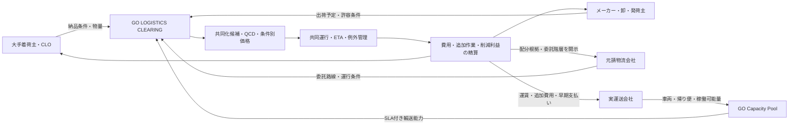

# GO LOGISTICS CLEARING 事業計画ドラフト

> 更新日：2026-08-21
> ステータス：仮説版。公開一次資料と既存調査に基づく。顧客ヒアリング、価格受容性、共同化率、競合売上は未検証。
> 数値の扱い：公表値には出典を付記し、それ以外は事業計画上の仮定として明記する。

## サマリ

|  | 一言で |
|---|---|
| **Issue** | 荷主・元請ごとのシステムと取引に運送能力が分断され、実運送の余力・品質・取引階層が荷主から見えない |
| **Insight** | 車両を持たなくても、分散した実運送会社を共通接続・運行標準・透明な精算で束ねれば、一つの信頼できる輸送能力になる |
| **Product** | 実運送会社を束ねたSLA付き輸送ネットワークと、複数荷主間の配分・運行・責任・利益分配を一括する物流クリアリング基盤 |
| **Wedge** | 大手着荷主1社の確約物量と、その納入を担う元請・下請・実運送会社を同時にネットワーク化する |
| **5年後** | 50社・180拠点・取扱高6,000億円、売上51.4億円、営業利益11.0億円 |

**GOがつくるのは「配送会社」ではない。これまで荷主・元請ごとに閉じていた実運送会社を束ね、一つの信頼できる輸送能力として社会に提供する市場インフラである。**

## ミッション、ビジョン

### ミッション

**運べる余白を、社会の力に変える。**

### ビジョン

**企業ごとに閉じた物流を、誰もがつながり、運ぶ人まで正当に報われる社会インフラへ。**

GOの全社ミッション「移動で人を幸せに。」とビジョン「日本を動かす、社会インフラへ。」を、モノの移動で実装する。

## エグゼクティブサマリ

大手着荷主を起点に、元請・下請の階層や荷主固有システムの外に出にくかった実運送会社を、GOの共通接続・運行標準・精算で束ねる。その輸送能力を、荷主に対して単一窓口、統一SLA、代替車両、実運送トレーサビリティ付きで提供する **GO LOGISTICS CLEARING** を立ち上げる。

荷主が買うのは「個別のトラック」ではなく、繁忙期も欠車時も代替でき、品質と原価の根拠を説明できる「束ねられた輸送能力」である。この実行データをCLOの中長期計画・定期報告とQCD改善に直結させる。

5年目に年間物流取扱高6,000億円、売上高51.4億円、営業利益11.0億円、営業利益率21.4%を達成し、「複数企業間物流クリアリング」の年間取扱高で国内No.1を目指す。No.1の定義は、単なる求貨求車件数ではなく、複数荷主・複数物流会社間で配分・運行・精算まで完了した物流取扱高とする。

勝ち筋は、最適化アルゴリズムではない。**多数の納入企業へルールを課せる大手着荷主の確約物量と納品条件変更権を取り、共同化による利益を公平に算出・配分し、事故・遅延時まで一つの運行責任を持つこと**である。

## 事業アイデア

### 誰のどのような問題を

対象は、大手小売・卸・メーカー等のCLO、SCM責任者、物流責任者である。

物流費を削減したい一方で、各部門・取引先・運送会社が別々の条件とシステムで動き、共同化余地が見えない。実運送会社は荷主・元請ごとに異なる配車、バース予約、動態、納品システムを操作し、自社の配車全体を俯瞰できない。荷主側も、誰が実際に運んでいるか、荷待ち・荷役がどこで発生し、幹線・帰り便にどれだけ余力があるかを一貫して把握できない。

仮に共同配送候補が見つかっても、競争情報の開示、公平な費用分担、運送責任、事故・遅延時の対応を決められず、個別実証で止まる。

現場では配車担当者が電話とExcelで調整しているが、納期・荷姿・納品時刻を変える権限は、営業、調達、倉庫、着荷主、物流会社へ分散している。

### どうやって解決するか

1. 荷主・元請ごとのTMS、バース予約、動態管理をAPI・CSV・共通ドライバーアプリで吸収し、運送会社が一つの運行キューで扱えるようにする。
2. 実運送会社と直接または委託階層を開示した契約を結び、路線、車格、温度帯、時間帯ごとの稼働可能量を「GO Capacity Pool」として集約する。
3. 各社の生データを秘匿したまま、共同輸配送候補と削減余地を算出する。
4. 荷主が「翌日必着」ではなく「24時間の幅」「混載可」「積替え1回まで」等の許容条件を登録できるようにする。
5. GOがネットワーク全体から価格・品質・CO2・到着確率を提示し、欠車時の代替車両を含めて運行を編成する。
6. 配送証跡、実運送会社、委託次数、荷待ち・荷役、遅延・破損責任を一貫管理する。
7. 運賃、追加作業費、削減利益をルールに沿って自動精算し、実運送会社への支払額と支払日を透明化する。

### 成功の鍵は何で、どう乗り越えるか

| 成功の鍵 | 現在の壁 | 乗り越え方 |
|---|---|---|
| 大手着荷主の物量とルール変更権 | 荷主を一社ずつ集めるとコールドスタートする | 多数の納入企業へ条件を課せる大手小売1社をアンカー化 |
| 公平な利益配分 | 「自社だけ損をする」不信 | 寄与度別の削減額計算、事前合意、第三者監査 |
| 競争情報の秘匿 | 運賃・取引先・物量を競合へ見せられない | データクリーンルーム、必要最小限情報、集計値のみ開示 |
| 実行責任 | マッチング後の破損・遅延責任が曖昧 | 標準契約、証跡、保険、24/365例外対応 |
| 物流会社からの中立性 | AZ-COM系列と見られると他社が入らない | 独立ガバナンス、非差別接続、配分ロジック監査、データ分離 |
| 既存システム接続 | TMS、WMS、EDI、伝票が企業ごとに異なる | 物流情報標準ガイドライン準拠APIと段階的コネクタ |
| 実運送会社の参加メリット | 新しいアプリの操作だけ増える恐れ | 多画面を一つに統合、帰り便・空き時間の収益化、早期支払い、実運送の寄与に応じた利益分配 |

## サービス概要

### 提供サービスサマリ

サービス名：**GO LOGISTICS CLEARING**

荷主・元請ごとに分断された実運送会社を共通レイヤーで束ね、荷主にはSLA付き輸送能力を、運送会社には多画面から解放された高稼働の仕事を提供する。企業横断の物流共同化を、分析だけで終わらせず、契約・運行・責任・精算まで完了させるBtoB物流基盤。

### ビジネスモデル図

### 詳細説明

#### 1. GO Capacity Network

- 荷主・元請ごとの受注、配車、バース予約、動態、納品完了をAPI・CSV・共通アプリで正規化
- 実運送会社は、複数の荷主システムを巡回せず、GOの一つのキューで確認・実行
- 路線、車格、温度帯、時間帯ごとの稼働可能量を束ね、年間・月間・スポットの輸送能力として販売
- 統一した安全・品質基準、代替車両、保険、例外対応をネットワークSLAとして提供
- 実運送会社には加盟料を原則求めず、空き能力の収益化、支払い早期化、荷待ち・荷役の適正請求で参加理由を作る

GOが「車両台数」を売るのではなく、複数会社の代替性によって納品成功率の一定水準をSLAとして約束する。これにより、一社では大手荷主の入札・監査要件を満たしにくい中小事業者も、ネットワークの一員として大口需要へアクセスできる。

#### 2. Opportunity Finder

- 重複路線、帰り便、納品時間の重なり、積載余力を検出
- 生データを競合企業へ開示せずに共同化可能性を算出
- 現状コスト、共同化後コスト、CO2、必要な条件変更を提示
- CLOの中長期計画、定期報告の基礎データを作成

#### 3. Flex Tender

- 発着地、標準パレット数、温度帯、納期、混載可否を登録
- 荷主が時間・経路・積替え回数の許容幅を入力
- 条件別の価格、到着確率、CO2を比較
- 緊急・専用は高く、柔軟・混載可能は安く値付け

#### 4. Clearing & Allocation

- 複数荷主と複数物流会社を制約条件下で組み合わせる
- 固定契約、自社便、協力会社、スポット便を同時に扱う
- 運行ごとに配分根拠を記録し、監査可能にする

#### 5. Execution Control

- バース・車両・積替え予約
- ETA、配送ステータス、証跡の企業横断共有
- 遅延、欠車、破損時の再配分と連絡
- 24時間365日の運行・CS体制は段階的に構築

#### 6. Settlement & Benefit Sharing

- 基本運賃、待機、荷役、積替え、緊急対応を分離請求
- 共同化による削減額を寄与度に応じて配分
- 遅延・品質ペナルティを自動計算
- 会社別、拠点別、路線別のROIを可視化

#### 7. CLO / QCD Control Tower

| 価値 | 可視化・改善する指標 | 荷主が得る結果 |
|---|---|---|
| Quality | 実運送会社、定時納品率、破損・誤配、温度逸脱、配送証跡 | 供給者ごとの品質評価と、問題路線の是正 |
| Cost | 基本運賃、燃料、待機、荷役、積替え、緊急便、委託次数、積載率 | コスト増の原因と、削減利益の配分根拠を説明 |
| Delivery | 確保能力、欠車率、ETA、リードタイム、代替手配時間、バース待機 | 繁忙期の安定輸送と、欠車・欠品・緊急便の削減 |
| CLO対応 | 輸送量、荷待ち・荷役時間、積載効率、CO2、外部連携施策、改善進捗 | 中長期計画、定期報告、経営会議への説明を同じ実行データから出力 |

透明性とは、全参加者に生の運賃・取引先を公開することではない。荷主には意思決定に必要な原価構造、委託階層、実行品質、継続的な供給リスクを開示し、参加企業間の競争情報は非開示・集計化する。

### プラン詳細・料金

| プラン | 対象 | 内容 | 料金仮説 |
|---|---|---|---:|
| Diagnose | 共同化余地を知りたいCLO | 3か月分データ分析、ROI試算、法対応レポート | 500万〜1,000万円／回 |
| Enterprise | 大手荷主・着荷主 | Opportunity Finder、Flex Tender、KPI・法対応 | 2,000万円／年 |
| Site | DC、物流拠点、大型店舗群 | バース・入出荷・共同運行管理 | 300万円／拠点・年 |
| Clearing | 実運行 | 配分、運行、証跡、精算 | 取扱物流費の0.5% |
| Gain Share | 削減成果が出た顧客 | 監査済み削減額から成果報酬 | 削減額の20%（初年度中心） |

実運送会社のネットワーク加盟料は原則無料とする。GOの収益は荷主側のEnterprise・Site利用料、運行取扱高に応じたClearing、削減成果に対するGain Shareから得て、実運送価格を不透明に買い叩くモデルと分ける。

価格は未検証。特に0.5%の受容性、成果報酬の算定基準、既存3PL手数料との重複を顧客ヒアリングで検証する。

### UI・UXの流れ

1. CLOが対象拠点・路線を選択する。
2. TMS/WMS/CSV/APIから3か月分の出荷・到着・運賃データを接続する。
3. ダッシュボードが共同化候補、削減額、必要な条件変更を提示する。
4. 荷主が時間幅・混載・積替え許容条件を選択する。
5. 参加物流会社へ、機密情報を除いた輸送条件が提示される。
6. GOが配分案と価格を確定し、各社が承認する。
7. 運行中はETA、引渡証跡、例外対応を一画面で管理する。
8. 月末に費用・追加作業・削減利益・CO2・法定KPIを自動精算・出力する。

実運送会社側では、現在利用している配車・デジタコ・スマートフォンのいずれかを接続する。複数荷主の指示は一つの運行キューへ変換され、空き時間の開示範囲、受託上限、希望運賃は会社ごとに制御できる。

### 提供サービスが選ばれる理由

- ルート最適化ではなく、企業間の合意・責任・精算まで完了する。
- 大手着荷主を起点にするため、物量のコールドスタートを回避できる。
- 個別運送会社の台数ではなく、複数会社の代替性で「確実に運べる能力」を提供できる。
- 実運送会社は荷主・元請ごとの多画面から解放され、帰り便・余力を自社の条件で販売できる。
- 生の運賃・顧客データを競合へ見せずに共同化できる。
- GOの配車、決済、CS、規制産業運営とMOMOAの実配送を組み合わせられる。
- 荷主だけでなく、物流会社・ドライバーへ削減利益を配分する「全方よし」の市場設計を採用する。

## 3C分析

### Customer（顧客・市場）

#### 誰が困っているか

一次顧客・支払者：

- 大手小売・卸のCLO、SCM責任者、物流責任者
- 多数の納入企業・物流会社を持つ大手着荷主

二次利用者：

- 発荷主の物流・出荷担当者
- 物流会社の配車・運行管理者
- DC・物流拠点の入出荷担当者
- ドライバー

#### 痛みが表面化するタイミング

- 運送会社からの値上げ・減便要請
- 繁忙期の車両不足、欠車、緊急便増加
- 配送遅延、欠品、店舗納品の乱れ
- 新センター、新地域、新店舗の立ち上げ
- 物流契約更新、3PL切替、M&A・物流網再編
- CLOの中長期計画・定期報告作成
- 荷待ち・荷役時間の拠点別計測開始
- CO2削減目標の未達

#### 狙うべき層

優先順位1：首都圏・関西圏に複数DCと多数店舗を持つ食品・日用品小売

優先順位2：小売へ多頻度納品する食品・飲料・日用品メーカー、卸

優先順位3：工場、商業施設、病院等、多数の納入企業へ入館・納品ルールを課せる大手着荷主

対象外：特殊貨物中心、完全専用網で既に高密度、競争上物流情報を一切共有できない企業、単発スポットのみの小規模荷主。

#### ユーザーヒアリング（1次情報ヒアリング）の結果

**現時点：対象顧客への一次ヒアリングは未実施。以下は公開資料・政府検討会資料から置いた仮説であり、顧客の発言として扱わない。**

##### ① 何に悩んでいるのか（仮説）

- 物流費総額は分かるが、どの条件・拠点・荷主が非効率を生んでいるか分からない。
- 共同配送候補が見つかっても、他社との費用分担・効果配分で止まる。
- 物流会社ごとにデータ形式・ステータスが異なる。
- 荷待ち・荷役時間を計測・報告する仕組みがない。
- 物流部門だけでは営業・調達・店舗の納品条件を変えられない。

##### ② どういうニーズがあるのか（仮説）

- 共同化前に自社の削減額を確定したい。
- 生の運賃・取引先・物量を競合に見せたくない。
- 現場運用を変える前に、小さな路線・拠点から有償検証したい。
- マッチングだけでなく、事故・遅延・精算まで一社に持ってほしい。
- 物流会社とドライバーにも利益が残る設計にしたい。

##### ③ 既存サービスでなぜ解消されていないのか（仮説）

- TMS・配車最適化は一社内の計画を改善するが、競合企業間の合意形成を扱わない。
- 求貨求車サービスは空き車両を探すが、荷主側の納期・荷姿・混載条件を変えない。
- 3PLは運行責任を持つが、特定企業・系列に閉じ、他3PLとの中立的な利益配分が難しい。
- コンサルティング実証は個別最適で、継続運行・精算プロダクトとして残りにくい。

#### 次に実施する一次ヒアリング

| 対象 | 件数 | 確認する問い |
|---|---:|---|
| 大手小売CLO・物流責任者 | 5社 | 法対応、値上げ、共同化の阻害要因、年間支払意思 |
| メーカー・卸物流責任者 | 5社 | 変更可能な納品条件、情報開示範囲、混載許容 |
| 大手・中小物流会社 | 8社 | 空き能力開示、最低手数料、配分公平性、運行責任 |
| DC・拠点責任者 | 5拠点 | 荷待ち、バース、荷役、例外処理の実態 |
| 法務・独禁法・保険 | 3名 | データ共有、共同価格、責任・保険設計 |

### ターゲット

#### ペルソナ

**氏名（仮）：佐藤直樹、48歳、大手食品スーパー 執行役員CLO**

- 売上高3,000億円、DC8拠点、店舗300店、納入企業500社、物流会社40社。
- 物流効率化法への対応を取締役会から求められている。
- 運送会社から8〜15%の値上げ要請が来ている。
- 共同配送の実証経験はあるが、他社とのコスト配分で本番化しなかった。
- 自社の物流データを競合小売へ渡すことはできない。
- 目標は物流費率、欠品、荷待ち時間、CO2を同時に改善すること。
- 500万円の診断は部門決裁できるが、年間2,000万円以上は削減額1億円以上の確証が必要。

### TAM（取れる可能性がある市場全体）：約1,728億円／年

#### 定義

2026年4月から中長期計画・定期報告・CLO選任の対象となる特定荷主約3,200社に対する、企業間物流分析・共同運行・精算基盤の年間売上機会。

#### 計算根拠

- 対象企業：3,200社（政府資料の特定荷主等の想定）
- 1社平均年間売上仮説：0.54億円
  - Enterprise 0.20億円
  - Site平均2拠点 0.06億円
  - Clearing・Gain Share平均 0.28億円
- 3,200社 × 0.54億円 = **1,728億円／年**

これは物流取扱高ではなく、プラットフォーム売上TAM。平均単価は未検証。

#### 成長率

交通・運輸・物流DX市場は、2022年3,947億円から2030年1兆2,377億円、CAGR15.4%との外部推計がある。GO LOGISTICS CLEARING固有市場の統計は存在しないため、**市場成長率の代理指標として年15%前後**を置く。規制対応と共同輸配送普及による上振れ余地はあるが、標準化・合意形成の遅れによる下振れも大きい。なお、この推計は富士キメラ総研の調査を引用した上場企業開示資料による二次利用値であり、正式版では原典を購入・確認する。

### SAM（実際にアプローチできる市場）：約270億円／年

#### 定義

特定荷主のうち、食品・日用品・小売・卸等、定常物量、共通納品先、標準化可能な常温・冷蔵貨物を持ち、企業横断共同化に適する大手企業。

#### 計算根拠

- 対象企業仮説：600社（特定荷主等3,200社の約19%）
- 1社平均年間売上仮説：0.45億円
- 600社 × 0.45億円 = **270億円／年**

600社は仮置き。業種別の特定荷主リスト、企業データベース、物流費開示から再推計する。

### SOM（5年で現実的に取れる市場）：約51.4億円／年

#### 定義

5年目に、関東・関西・東海・九州等で導入する大手荷主・着荷主50社、180拠点、年間物流取扱高6,000億円から得る売上。

#### 計算根拠

- Enterprise：50社 × 0.20億円 = 10.0億円
- Site：180拠点 × 0.03億円 = 5.4億円
- Clearing：6,000億円 × 0.5% = 30.0億円
- Gain Share等：6,000億円 × 売上換算0.1% = 6.0億円
- 合計：**51.4億円／年**

SAM比19.0%。年間取扱高6,000億円とアンカー50社の獲得が最大の挑戦。

### Company（GO）

#### 強み

- 分散した供給事業者をオンボーディングし、位置情報で配分する能力
- 配車だけでなく決済、CS、例外対応を運用する能力
- 規制産業で、公平性・透明性・安全性を扱ってきた経験
- GO BUSINESSを含む大企業営業・請求基盤
- MOMOAによるネットスーパー等の実配送現場
- AZ-COM丸和の小売物流、EC物流、車両・拠点・顧客接点
- 荷主・元請ごとに分断した実運送を、中立なネットワーク品質として再編できる事業仮説
- 「全方よし。」を市場ルールに反映できるブランド思想

#### 弱み

- BtoB幹線・センター納品のTMS/WMS/EDI知識は専業物流テックに劣る
- GOはAZ-COM系列と見られ、中立性を疑われる可能性
- 大手着荷主の物流ルール変更権を現時点で持っていない
- 企業間費用配分・独禁法・貨物保険のプロダクト経験が不足
- 長いエンタープライズ営業・システム接続期間が必要

### Competitor（競合）

#### 競合一覧

| 競合・類型 | 主な価値 | 強み | 本案との差・満たせていない価値 |
|---|---|---|---|
| ハコベル | 運送手配、配車計画、運行管理、バース予約 | セイノー等の物流ネットワーク、BtoB知見、SaaS | 企業横断の秘匿分析、削減利益配分、独立した精算機構が中心ではない |
| CBcloud / PickGo | 荷主と配送パートナーの接続、実運送 | 軽貨物供給、24/365、エコ配、物流施設連携 | 大手着荷主起点の中長期共同化・CLO向け利益配分が中心ではない |
| エニキャリ | ラストマイルDMS、ルート・オンデマンド統合、共同配送 | 5,000万件規模の配送実績、伊藤忠連携 | 都市ラストマイル中心。幹線・ミドルの企業間費用精算は対象外 |
| OptiMind等 | AIルート最適化 | アルゴリズム、導入しやすさ | 一社内最適。企業間契約・責任・利益配分を扱わない |
| 大手3PL | 一括物流受託 | 現場、拠点、車両、顧客信頼 | 系列・個社最適になりやすく、競合3PLへ中立的に開きにくい |
| ERP/TMSベンダー | 受発注・輸送管理 | 基幹システム、既存顧客、データ | 実運送責任、供給ネットワーク、成果報酬を持ちにくい |
| 業界共同実証・コンサル | 共同配送設計 | 合意形成、業界知識 | 個別案件化しやすく、継続的な運行・精算プロダクトになりにくい |

#### ポジショニングマップ

|  | 個社・系列内 | 企業横断・オープン接続 |
|---|---|---|
| 分析・計画中心 | TMS、ルート最適化、コンサル | 補助事業のデータマッチング、共同化診断 |
| 実行・責任・精算まで | 大手3PL、宅配各社の自社網 | **GO LOGISTICS CLEARING（狙う位置）**、一部ハコベル・CBcloud |

#### 市場シェアが割れている理由考察

- 貨物、温度帯、荷姿、地域、業界慣行が異質で、一つのプロダクトに統合しにくい。
- 顧客が既存3PL・運送会社との長期契約を持ち、切替コストが高い。
- 供給ネットワークを持つ会社と、ソフトウェアに強い会社が分かれている。
- 大手物流会社は自社網を外へ開くインセンティブが弱い。
- 物流情報が競争情報で、標準化・共有が進みにくい。
- マッチング後の運行・事故責任が重く、SaaSだけでは完結しない。

#### 競合が満たせていない価値

**荷主・元請ごとに分断した実運送会社を、多画面と不透明な委託階層から解放しつつ束ね、荷主には単一窓口・統一SLA・代替能力のある輸送ネットワークとして提供すること。その上で、競合荷主同士が生の運賃・顧客情報を見せずに共同化し、実運行・事故責任・精算まで中立的に完了すること。**

これは公開情報に基づく仮説。各競合が非公開で類似機能を提供している可能性をヒアリング・デモで確認する。

## 事業戦略とKSF

### 事業戦略（5年後No.1目標）

#### Phase 0：検証（0〜6か月）

- 大手小売CLO等23件以上の一次ヒアリング
- 1社から3か月分の匿名化データ提供
- 実運送会社8社以上に、荷主・元請システムの利用数、二重入力時間、空き能力の開示条件、直接精算への参加意向をヒアリング
- Opportunity Finderの手動・半自動版で共同化ROIを提示
- 有償診断2件、LOI1件を獲得
- NO-GO条件：削減余地3%未満、年間支払意思1,000万円未満、物流会社が必要データを出さない

#### Phase 1：アンカー獲得（1年目）

- 大手小売2社、4拠点で有償稼働
- 既存TMS/WMSへのCSV・API接続
- 共同化候補、費用配分、法対応レポートを商品化
- 実運行はMOMOA・AZ-COM・参加物流会社と限定路線で実施
- 3〜5社の実運送会社を「GO Capacity Pool」に接続し、欠車時の代替手配と実運送トレーサビリティを検証

#### Phase 2：一社内N対N（2年目）

- アンカー着荷主1社の納入企業・物流会社を横断接続
- 関東15拠点、年間物流取扱高400億円
- 標準契約、保険、荷待ち・荷役精算を確立
- 大手物流会社2社以上を非差別接続

#### Phase 3：複数着荷主間接続（3年目）

- 同業または異業種の大手着荷主15社、45拠点
- 関東から関西・東海へ展開
- Flex Tenderと自動配分を本番化
- 年間物流取扱高1,200億円、売上11.6億円

#### Phase 4：オープン・クリアリング（4年目）

- 参加条件とAPIを公開
- 複数TMS、3PL、物流施設へ接続
- 年間物流取扱高3,000億円
- 単年度黒字化

#### Phase 5：国内No.1（5年目）

- 50社、180拠点、物流取扱高6,000億円
- 売上51.4億円、営業利益11.0億円
- 主要都市圏・主要小売納品網へ展開
- 次段階として鉄道・船舶・自動運転車との接続を開始

### KSF

1. **大手着荷主の確約物量と納品ルール変更権**
2. **複数の実運送会社を、単一窓口・統一SLA・代替能力のある一つの輸送商品にする能力**
3. **共同化効果と費用負担を公平に算出・説明する能力**
4. **マッチング後の運行品質、例外対応、責任・保険**
5. **競合物流会社が参加できる中立性とデータガバナンス**
6. **既存TMS/WMS/EDIへ低負担で接続する標準API**

最重要KSFは1と2の同時成立。大手着荷主の物量だけではGOは別の元請になり、運送会社を集めるだけでは仕事がない。アンカー物量を持つ着荷主の納入網を一括で接続し、そこで発生する実運送を束ねることで両面のコールドスタートを回避する。

### 各戦略詳細説明

#### ユーザー獲得戦略

- GO経営陣・次世代事業本部によるトップ営業
- AZ-COM丸和の小売・EC顧客へ共同提案。ただしGO側でデータ中立性を担保
- CLO、物流部長を対象にしたアカウントベースドマーケティング
- 500万〜1,000万円の有償診断から入り、削減額確認後に年間契約
- 物流効率化法対応、荷待ち・荷役計測を入口にする
- 業界団体、標準化懇談会、政府実証を初期信用獲得に活用するが、補助金なしの継続契約を必須条件にする

#### UX

- 初回価値到達を「データ接続後4週間以内」に設定
- 共同化候補を1件以上、削減額を円で提示
- 現場へ新端末を大量導入せず、既存TMS/WMS/ドライバーアプリへ接続
- 承認前に、参加各社の利益・リスク・変更条件を個別表示
- 配分理由、運賃内訳、追加作業を説明可能にする

#### 広告・営業の試算

マス広告は行わない。CLO向けのABMとトップ営業を中心とする。

| 年 | 営業・マーケ費 | 対象アカウント | 新規契約 | 契約獲得費仮説 |
|---:|---:|---:|---:|---:|
| 1 | 0.5億円 | 30社 | 2社 | 0.25億円／社 |
| 2 | 1.0億円 | 80社 | 4社 | 0.25億円／社 |
| 3 | 1.8億円 | 150社 | 9社 | 0.20億円／社 |
| 4 | 2.8億円 | 250社 | 15社 | 0.19億円／社 |
| 5 | 4.0億円 | 350社 | 20社 | 0.20億円／社 |

システム接続・PoC人員を含む実質CACは0.3〜0.5億円／社を想定。5年目の顧客当たり平均売上約1.0億円、粗利約0.72億円なら、回収期間は12〜24か月を目標とする。

#### エリア展開

1. 首都圏：物量密度、GO・MOMOA・AZ-COM接点、大手本社が集中
2. 関西圏：首都圏との幹線往復、商業・食品物流の密度
3. 東海圏：製造・小売物流、関東関西の中間結節
4. 九州北部：福岡都市圏と本州幹線
5. 仙台・札幌等：主要都市圏。過疎地維持は本事業の初期対象外

#### 拠点の展開順番

- 原則として自社物流拠点を建設しない。
- アンカー顧客の既存DC、AZ-COM等の既存施設、第三者物流施設を利用する。
- 新規共通クロスドックは、年間物量、積替え削減効果、回収期間36か月以内が確認できた場所だけ設置する。

### 組織構造

#### 5年目の組織案

| 組織 | 人数 | 主な役割 |
|---|---:|---|
| 経営・事業企画 | 7 | 戦略、アライアンス、P/L、政策対応 |
| Product / Engineering / Data | 40 | API、最適化、データクリーンルーム、UI、SRE |
| Network Operations | 30 | 運行設計、24/365例外対応、物流会社支援 |
| Enterprise Sales / Customer Success | 25 | CLO営業、導入、ROI、拡張 |
| Legal / Risk / Trust | 8 | 独禁法、契約、保険、監査、データガバナンス |
| Corporate | 5 | 人事、経理、管理 |
| 合計 | **115** |  |

初年度25名：Product/Engineering 10、物流運用6、Sales/CS 5、Legal/Data Governance 2、経営管理2。

#### 各組織のKGI/KPI

| 組織 | KGI | KPI |
|---|---|---|
| 事業 | 売上・営業利益・取扱高 | アンカー社数、取扱物流費、テイクレート |
| Sales | 契約ARR | CLO商談、診断成約率、PoC→本番率、CAC回収月数 |
| Customer Success | NRR 120%以上 | 拠点拡張、利用路線、削減額、更新率 |
| Product/Data | 共同化GMV | データ接続日数、共同化候補精度、自動配分率 |
| Network Operations | 安全・定時完了 | 受諾率、定時率、積載効率、例外介入率、事故率 |
| Trust/Legal | 公平・安全な市場 | 配分異議率、精算差異、データ事故、監査指摘 |
| 社会価値 | 輸送生産性 | 荷待ち・荷役削減、空車距離、ドライバー還元額、CO2 |

## 収支計画（5年間）

### 主要前提

- Enterprise：0.20億円／社・年
- Site：0.03億円／拠点・年
- Clearing：物流取扱高の0.5%
- Gain Share等：物流取扱高に対する売上換算0.1%
- 売上総利益率：55%から72%へ改善
- 単年度黒字化：4年目
- 3年目までの累積営業損失：約15.9億円
- システム・運転資金を含む必要投資額：20〜25億円を想定

### 年次計画

|  | 1年目 | 2年目 | 3年目 | 4年目 | 5年目 |
|---|---:|---:|---:|---:|---:|
| アンカー顧客数 | 2 | 6 | 15 | 30 | 50 |
| 拠点数 | 4 | 15 | 45 | 100 | 180 |
| 物流取扱高 | 100億円 | 400億円 | 1,200億円 | 3,000億円 | 6,000億円 |
| 売上高 | 1.1億円 | 4.1億円 | 11.6億円 | 27.0億円 | 51.4億円 |
| 売上総利益率 | 55% | 60% | 65% | 68% | 72% |
| 売上総利益 | 0.6億円 | 2.4億円 | 7.5億円 | 18.4億円 | 37.0億円 |
| 営業費用 | 5.5億円 | 8.5億円 | 12.5億円 | 18.0億円 | 26.0億円 |
| 営業利益 | ▲4.9億円 | ▲6.1億円 | ▲5.0億円 | 0.4億円 | 11.0億円 |
| 営業利益率 | — | — | — | 1.3% | 21.4% |
| 人員 | 25 | 40 | 60 | 85 | 115 |

### 感度分析

| ケース | 5年目取扱高 | Clearing率 | 5年目売上 | 判断 |
|---|---:|---:|---:|---|
| Downside | 3,000億円 | 0.35% | 約26億円 | 黒字化は5年目以降。事業縮小・SaaS寄りへ |
| Base | 6,000億円 | 0.50% | 51.4億円 | 4年目黒字化、国内No.1を狙う |
| Upside | 9,000億円 | 0.60% | 約76億円 | 全国展開、鉄道・船舶接続を前倒し |

売上は取扱高とテイクレートへの感応度が高い。5年目6,000億円の確度が低い場合、固定費を持つ24/365運用を早期に拡大しない。

## 主要リスクと撤退条件

| リスク | 早期指標 | 対応・撤退条件 |
|---|---|---|
| 共同化余地が小さい | 診断削減率3%未満 | 対象業界・路線を変更。3社連続なら撤退検討 |
| 支払意思が弱い | 年1,000万円未満 | SaaS単体でなく成果報酬化。それでも弱ければNO-GO |
| 中立性が成立しない | 大手物流会社が参加拒否 | ガバナンス分離。供給2社以上を取れなければ拡大しない |
| 接続費が高すぎる | 導入6か月超、個別開発3,000万円超 | 標準コネクタ対象外は受注しない |
| 事故・例外コスト | 介入率10%超 | 対象貨物を標準化。粗利が正にならなければ運行しない |
| 法務・競争法 | 料金共有が必要 | 必要最小限データ、第三者監査。適法設計できなければ機能停止 |
| 既存競合に模倣される | ハコベル等が精算機能を実装 | 大手着荷主の物量、運行データ、標準契約を先に押さえる |
| GOが新たな多重下請になる | 実運送への支払比率低下、委託次数増加 | 実運送会社・委託次数・支払額の可視化、直接精算、適正原価を下回らないルール |
| 利用運送・保険・約款設計が成立しない | 単一窓口SLAでの受注ができない | Phase 0で必要許認可、運送責任、保険、再委託条件を法務検証。不成立ならシステム連携・精算基盤に範囲を限定 |

## ミッション、ビジョンの再掲

### ミッション

**運べる余白を、社会の力に変える。**

今日も日本中で、荷物を載せられる車が空のまま走り、その隣で別の誰かが運べる車を探している。多くの実運送会社は、荷主・元請ごとに異なるシステムと指示の中で、自社の運べる力を外に開くことができない。問題は、車が一台もないことではない。誰が、いつ、どの品質で運べるかを、企業の境界を越えて信頼できる形に束ねる仕組みがないことだ。

私たちは、荷物、車両、拠点、時間の余白をつなぎ、運ぶ人の頑張りではなく、社会の仕組みで物流を支える。

### ビジョン

**企業ごとに閉じた物流を、誰もがつながり、運ぶ人まで正当に報われる社会インフラへ。**

荷主にとっては、一つの窓口から必要なときに必要なだけ、説明可能なQCDで運べる。物流会社にとっては、荷主・元請ごとの多画面から解放され、空き能力が正しく価値になる。ドライバーにとっては、待機や無償作業ではなく、運ぶ仕事が正当に報われる。

GOは荷物をすべて運ぶ会社になるのではない。日本中の「運べる力」を見えるようにし、公平に配分し、次の100年もモノが動き続ける基盤をつくる。

## 参考一次資料・主要出典

- [GO株式会社 ミッション・ビジョン](https://goinc.jp/about/)
- [GO・AZ-COM丸和・JQSによるMOMOA設立](https://goinc.jp/news/info/2025/05/26/6sxavdk2u9l4ibeem1ata5/)
- [MOMOAのネットスーパー配送・Baggage GO](https://go-on.goinc.jp/n/n1537c1543831)
- [総合物流施策大綱（2026年度〜2030年度）](https://www.mlit.go.jp/seisakutokatsu/freight/content/001993236.pdf)
- [経済産業省 物流効率化法](https://www.meti.go.jp/policy/economy/distribution/logistics_efficiency/bukkouhougaiyou.html)
- [経済産業省 物流効率化法説明資料（特定荷主等は上位3,200社程度）](https://www.meti.go.jp/policy/economy/distribution/20260518_setsumeikai-siryo1.pdf)
- [JILS 2025年度物流コスト調査](https://www1.logistics.or.jp/news/news-12744/)
- [交通・運輸・物流DX市場の外部推計を引用する上場企業開示資料](https://www2.jpx.co.jp/disc/70460/140120240515597861.pdf)
- [国土交通省 物流情報標準ガイドラインver3.00](https://www.mlit.go.jp/report/press/tokatsu01_hh_000853.html)
- [国土交通省 共同輸配送の課題に関する資料](https://www.mlit.go.jp/seisakutokatsu/freight/content/001906276.pdf)
- [公正取引委員会 競合運送事業者による共同輸送](https://www.jftc.go.jp/dk/soudanjirei/r1/h30nendomokuji/h30nendo08.html)
- [ハコベル](https://corp.hacobell.com/home)
- [CBcloud](https://cb-cloud.com/)
- [エニキャリ](https://www.anycarry.co.jp/)
