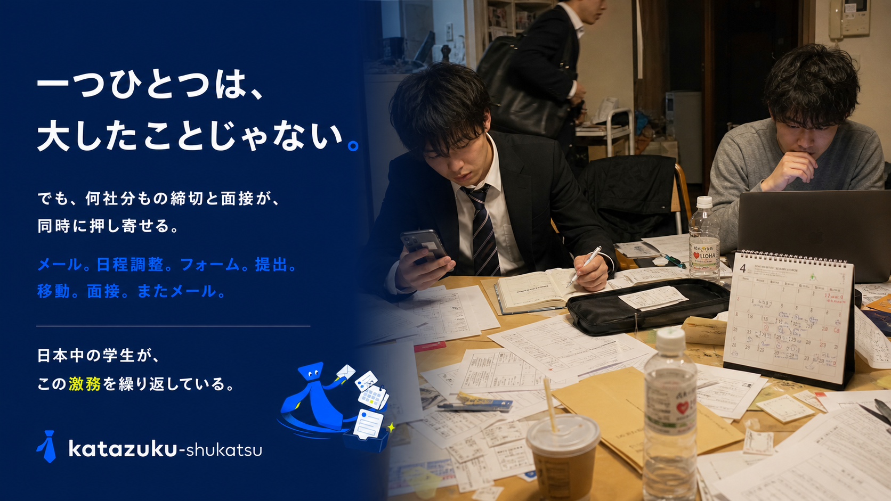
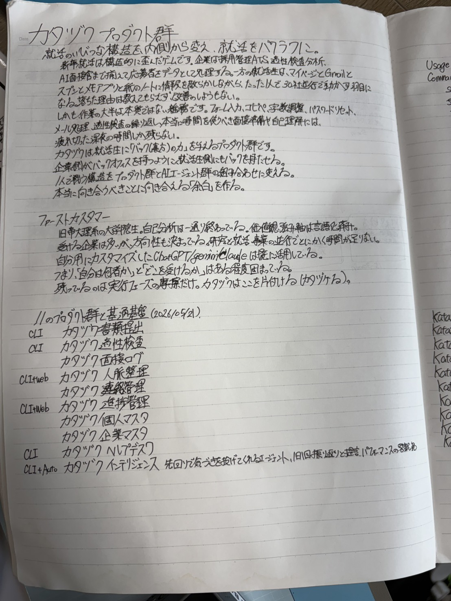
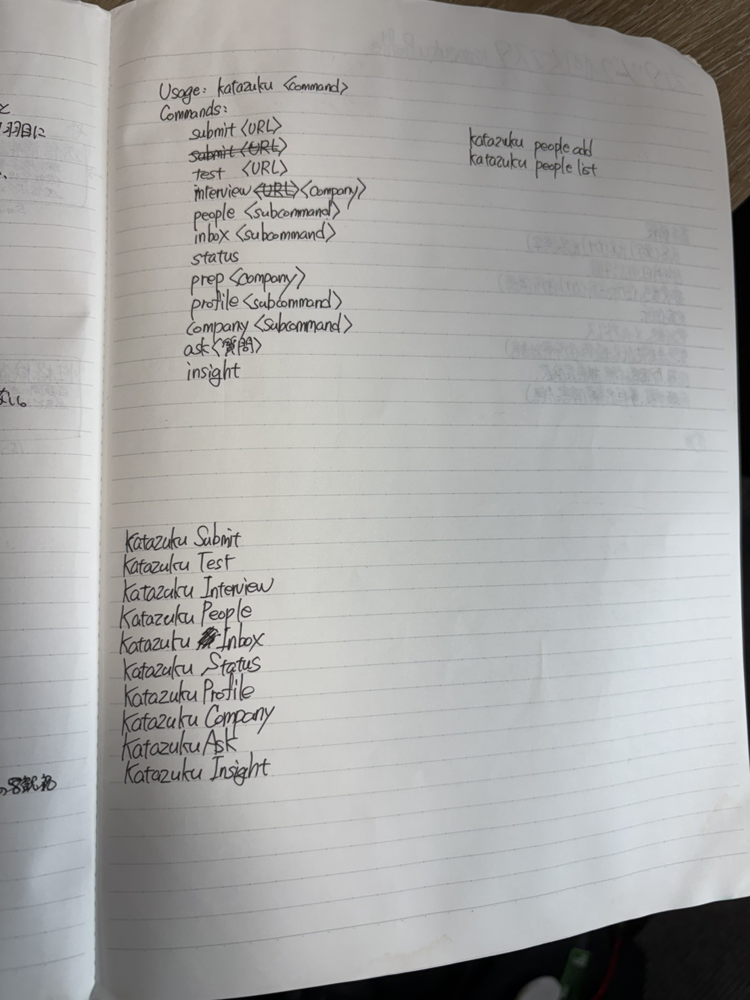
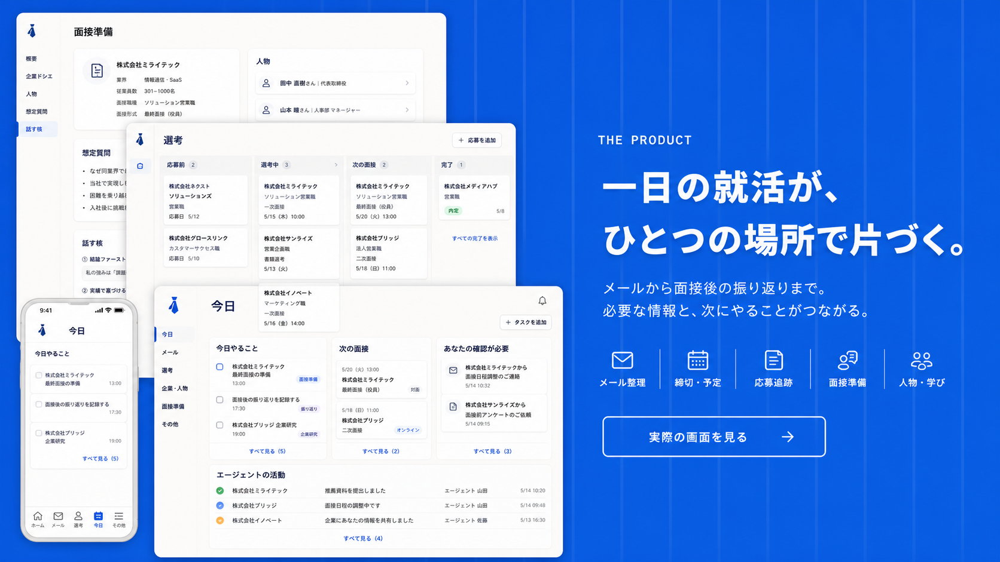
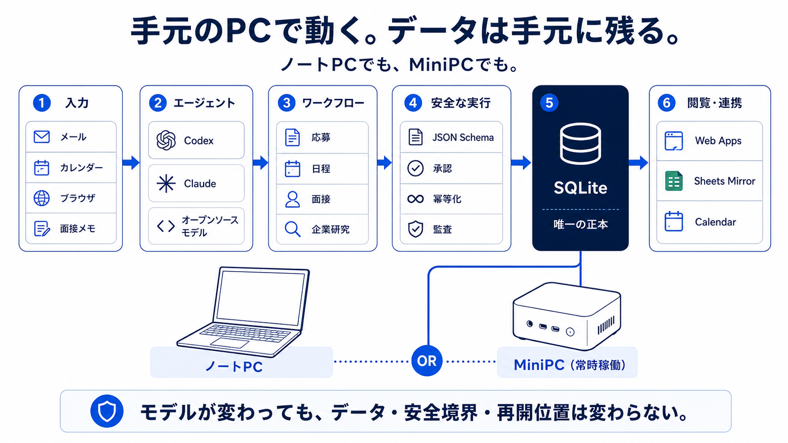
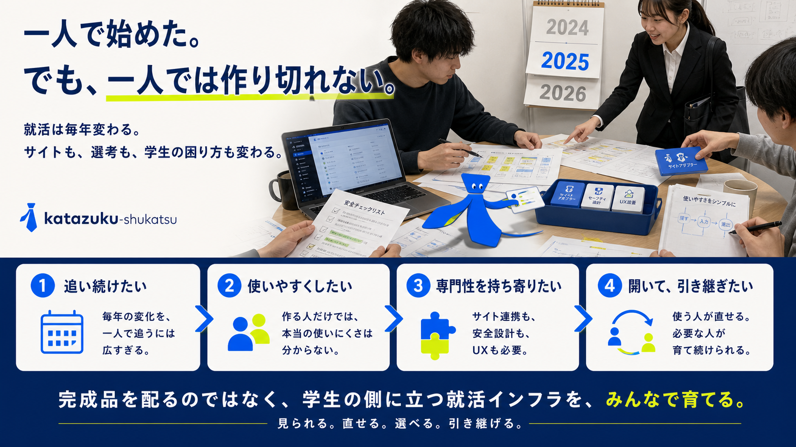

はじめまして、奥山といいます。Zennへ投稿するのは、これが初めてです。

技術記事として、こういう書き方で合っているのか。自分の就活の話を、ここまで長く書いてよいのか。正直、まだよく分かっていません。

ただ、完成したものとコードだけを並べるより、何に困って、何を作り、どこで失敗して、なぜ今の形になったのかまで残したいと思いました。同じようなことを作る人や、就活の小さな事務作業に疲れている人へ、どこか一つでも役に立てばうれしいです。

4月、就活を始めました。

地方大学の理系院生です。始める前は、就活で大変なのはESと面接だと思っていました。

自分のことを言葉にする。企業のことを調べる。面接で知らない人に、自分の考えを伝える。そこが大変なのだろう、と。

実際、それは大変でした。

でも、始めてすぐに別の大変さが見えてきました。

朝、メールを開く。説明会の案内、スカウト、選考結果、予約確認、締切のリマインドが、同じ受信箱に並んでいる。必要な一通を見つけて、日付をカレンダーへ移す。企業のマイページを開き、前にも書いた住所や学歴をまた入力する。

ESを書くときは、Driveからガクチカを探す。ChatGPT、Claude、Geminiに投げて、文字数を合わせる。良さそうな案を選び、また直す。できた文章をコピーして、ブラウザへ戻り、フォームに貼る。

面接が決まれば、研究の予定と重ならないかを見る。対面なら、地方から本当に移動できる時間なのかも考える。

一つ終える頃には、別の企業からメールが来ています。

最初は、まだ管理できているつもりでした。スプレッドシートも作った。カレンダーにも入れた。メールも毎日見ていました。

それでも、面接に関するリマインドをうまく拾えなかったことがあります。

結果として、選考の機会を一つ失いました。

選考を受けて落ちたわけではありません。話す前に、事務のところで終わってしまいました。

もちろん、管理できなかったのは自分です。でも、「もっと気をつけよう」だけで終わらせるには、同じような作業が多すぎました。

実際に数えてみました。自分の直近データから45日分へ外挿すると、宣伝やスカウトは250〜350件、日程調整は25〜35件、フォーム提出は15〜20件、合否連絡は20〜25件ほどありました。

問題は、一つひとつが難しいことではありませんでした。

むしろ、一つひとつが小さすぎることでした。

メールを一通読む。日付を一つ写す。フォームを一つ埋める。タブを一つ移動する。どれも数分で終わるから、仕組みを変えるほどではないように見える。でも、それが何社分も、何週間も、同時に続きます。



これを、日本中の学生が毎年やっています。

それは、かなりもったいないのではないか。

考えることや、人と話すことではなく、情報を右から左へ運ぶために、学生の時間が使われている。その部分は、もっと機械に任せられるはずです。

そう思って作り始めたのが、[katazuku-shukatsu](https://github.com/kokotatan/katazuku-shukatsu)です。就活の事務を、本人の手元のPCで片づけるためのローカルAIエージェント基盤です。

技術的にいうと、これは「派手に動くこと」より「安全に失敗できること」を優先して設計した、常時稼働のエージェント基盤です。芯は3つだけです。

- **正本は手元のローカルSQLite**。書き込むのはエージェントだけで、人もアプリも直接は書かない。表示用にGoogleシートやWebアプリへ一方向でミラーする。
- **LLMには事実の抽出だけを任せる**。選考ステータスの遷移、企業やコースの名寄せ、二重送信・二重予約の防止、最終送信の承認は、LLMではなく決められたコードが担う。
- **途中で止まっても、同じrunの続きから戻れる**。モデルの利用上限やPCのスリープで処理が中断しても、副作用の種類ごとに再開を分け、二重に送らない（provider非依存・冪等・中断復帰）。

ブラウザを自動操作する部分より、この土台のほうが本体です。以下は、その土台をどう作り直していったかの記録でもあります。

ただ、最初から今の形が見えていたわけではありません。

スプレッドシートをDB代わりにしました。GASとCLIで一度作り、使わなくなりました。使われないGUIも作りました。AIがカレンダーを見ずに予定を組み、Claudeの週間上限で処理が止まりました。メールで通知しても見なくなり、スマホのホーム画面へ届くWeb Pushも作りました。LabBaseの自動ログインも、SSOセッションが切れれば止まります。自動運転が止まったことを見つける番犬まで必要になりました。最後には、個人情報だらけのリポジトリを前にOSS化の難しさも知りました。

この記事では、うまくいった機能だけではなく、そこへ至るまでに何が壊れ、なぜ作り直したのかを書きます。

## その前に一度、Discordで動かそうとして失敗している

実は、就活の自動化を作ろうとしたのは、これが最初ではありません。この形にたどり着く前に、一度作って、うまくいかずにやめています。

きっかけは、あるインターン先でバックオフィス業務向けのAIエージェントを作ったことでした。定型的な事務が思った以上に片づいて、これは効くと感じました。

それで、「同じものが個人にも要る」と思いました。特に自分のように、事務作業の抜け漏れが起きやすいタイプにこそ要る、と。最初に作った[AIHelper_shukatsu](https://github.com/kokotatan/AIHelper_shukatsu)は、そういう発想でした。運用の入り口はDiscordにしようとしました。普段から開くところにbotがいれば、続けて使えるはずだと思ったからです。

でも、結局うまく動きませんでした。

あとから考えると、理由ははっきりしています。会社の業務は、対象も権限もデータも、ある程度そろっていました。一方、個人の就活は、メールも、カレンダーも、応募媒体も、住所やESの素材も、全部バラバラの場所にあります。入り口をDiscordのチャットに寄せても、肝心のデータがそこに集まってこない。会話UIだけあっても、裏に「いま何がどうなっているか」を持っていないので、頼んでも中身が動きませんでした。

このときの失敗で学んだのは、入り口（チャットや画面）より先に、裏の状態を持つ場所を決めるべきだった、ということでした。この反省が、あとでkatazukuの正本DBへつながります。

## まずは、普通にスプレッドシートで管理していた

就活を始めた時点で、自己PRやガクチカの素材はある程度できていました。Google Driveに文章を置いて、どの企業を受けているかはスプレッドシートで管理していました。

ただ、同じガクチカでも、企業によって設問の聞き方と文字数が違います。

ChatGPT、Claude、Geminiに素材と設問を投げる。返ってきたものから良さそうな案を選ぶ。文字数を合わせてもらう。読んでみて、また直してもらう。

文章ができたら、コピーする。ブラウザを移動する。応募フォームに貼る。次の設問へ移る。またコピーする。

生成AIのおかげで、文章をゼロから考える時間は減りました。でも、Driveから素材を探して、AIへ渡して、出力を選んで、フォームへ運ぶ仕事はそのまま残っていました。

スプレッドシートは整理してくれる。生成AIは書いてくれる。でも、その間を移動するのは自分です。

この「道具の間」をつなげたかったのが、最初の動機でした。

## GASとCLIで一回作った。でも、使わなくなった

最初はGoogle Apps ScriptとCLIを組み合わせました。

スプレッドシートをDBのように使って、メールやカレンダーとつなぎ、コマンドを打てば処理が進む。頭の中では、かなりうまくいきそうでした。

一度は形になりました。でも、日常的に使えるものにはなりませんでした。

当時は「AIに何をさせるか」ばかり考えていて、次のことをほとんど決めていませんでした。

- スプレッドシート、メール、カレンダーのどれが正しいのか
- 処理が途中で止まったら、どこから再開するのか
- 送信できたか分からないとき、もう一度押してよいのか
- 企業名の表記が違うとき、同じ会社として扱うのか
- 同じ会社の別職種や別インターンを、どう分けるのか

正常に動いている間は、それっぽく見えます。一度止まると、何がどこまで終わったのか分からない。結局、自分でメールとシートを見直すことになります。

それでは、使わなくなります。

後から考えると、最初に作るべきだったのは賢いプロンプトではなく、失敗しても戻れる土台でした。

## 5月、Claude in Chromeを教えてもらった

転機になったのは、5月に参加したあるインターンでした。

そこで会った学生に、Claude in Chromeを教えてもらいました。

AIが文章を返すだけではなく、実際にブラウザを見て、クリックして、入力して、次のページへ進んでいく。初めて見たときは、かなり驚きました。

正直、技術的には適性検査の画面にも触れられるのでは、と思いました。もちろん、それはやりません。本番のWeb適性検査やコーディングテストは本人が受けるものです。katazuku-shukatsuでも、代理受験、問題の保存、解答生成、解答入力は明確に禁止しています。

ただ、適性検査へ行く前の作業は別です。

企業を調べる。応募ページを探す。マイページを作る。プロフィールを入れる。設問と求める人物像を見て、手元のES素材のどこを強めるか考える。フォームへ移す。

このあたりは、かなりのところまでできるのではないかと思いました。

最初に試したのは、エントリーの繰り返し作業でした。そこから少しずつ、自動エントリー、企業研究、マイページ作成、ESの転記へ広げていきました。

単発のブラウザ操作ではなく、就活全体を扱うものにしたいと思い始めたのも、この頃です。

## ノートに、欲しいものを全部書いた

当時のノートが残っています。



`submit`、`test`、`interview`、`people`、`inbox`、`status`、`prep`、`profile`、`company`、`ask`、`insight`。

先に欲しいコマンドを全部並べて、それぞれ何を片づけるかを書きました。



もちろん、全部を一気に作れたわけではありません。そのときの自分が一番困っていたものから作りました。

最初は書類提出の`submit`。次に、氏名、学歴、連絡先、ES素材をまとめる個人マスタ。その後にメール対応と進捗管理。さらに面接記録、企業研究、日程調整へ広がりました。

一方で、使われないGUIも作りました。

画面があると、プロダクトを作った感じがします。でも、朝の自分がその画面を開かなければ意味がありません。結局、CLIと自動実行だけを使い、GUIは放置する時期がありました。

この失敗以降は、まずデータの流れを通す。実際の就活で何度か使う。そのあとで、見る必要があるものだけ画面にするようになりました。

## それで、いま何が片づくのか

ここまでだと、「就活用のDBを作った話」に見えるかもしれません。

でも、DBは表に出ない土台です。自分が欲しかったのは、朝から夜までの就活を少しずつ片づけてくれる仕組みでした。

先に断っておくと、ここから書くのは、自分が実際に使ってきたprivate版の機能も含みます。公開版は、その中から個人情報を除き、安全に共有できるコアを切り出している途中です。GitHubからcloneしただけで、以下のすべてがすぐ動くわけではありません。



### 朝、受信箱ではなく「残り3件」から始める

MiniPCでは、朝の同期が自動で動きます。就活用を含む複数のGmailから新着を取得し、宣伝、スカウト、日程調整、選考結果、提出依頼などに分けます。締切や面談を抽出してDBを更新し、必要な予定はカレンダーへ反映します。就活媒体から来た古い宣伝メールは、一定期間を過ぎたものだけ受信箱から片づけます。

そのあとに見るのは、受信箱の未読件数ではありません。

```powershell
katazuku asa
```

`asa`は、その朝に本人がやる必要のあることを3件までに絞ります。返信案を確認する、ESの最終送信を承認する、今日の面接準備を見る、といったものです。

自動化できるものを全部自動化しても、最後に20件の確認リストを渡されたら、あまり楽ではありません。「機械が片づけたあとに、人間へ何を残すか」まで決める必要がありました。

外出中ならスマホのPushで件数だけ分かります。ロック画面には企業名や選考結果を出しません。詳しい内容は、認証したWebアプリを開いて見ます。

### カレンダーは一目で見る場所、アプリは深く見る場所

予定の時刻と場所だけを知りたいときに、毎回専用アプリを開くのは面倒です。

そこで、Googleカレンダーには、時刻、オンラインか対面か、会議URL、相手、直前に見る短いメモを置きます。前日までに準備できた場合は、イベントの説明欄へ`--- prep ---`として短い対策メモも追記します。

たとえば、カレンダーだけなら次のくらいです。

```text
14:00  A社 二次面談
Google Meet: https://...
前回の宿題: 入社後に取り組みたいテーマを一つに絞る
直前メモ: 研究で問いを立て直した話 / 逆質問2件
```

企業の事業、募集ポジション、過去の面談、相手の経歴、想定質問まで見たいときは、Prepアプリを開きます。

この役割分担はかなり気に入っています。簡単なことは、普段から見るカレンダーで終わる。詳しく知りたいときだけ、アプリへ潜る。すべてを一つの巨大な管理画面へ詰め込まなくてよくなりました。

Webアプリは、現在8つあります。

- `Inbox`: メールから起きた更新と、本人の対応待ち
- `Status`: 企業ごとの選考状況を横断して見るボード
- `Insight`: 今日、明日、今週、期限超過の「やること」
- `Profile`: 確定した自分の情報と、面接から得た自己理解の候補
- `People`: 面接官、社員、OBOGと、いつ何を話したか
- `Prep`: 企業研究、相手、過去面接、想定問答をまとめた直前画面
- `Impact`: どのくらいの処理を片づけたか
- `Board`: 予定、締切、企業、選考をまとめて見る画面

全部を毎日開くわけではありません。普段はカレンダーとPush、必要なときだけ該当する画面です。

### 前夜に、明日の面談の記憶を戻す

毎晩20時15分には、翌日の面接、面談、座談会、テストを探して「前夜ブリーフ」を作ります。

DBにある予定だけでは足りません。企業から届いた最新メールも見直します。会議URLが変わっていないか、入館方法はあるか、録画への同意や事前書類の依頼が追加されていないか、面接官の名前が後から届いていないか。予定を登録した時点と、前日の最新情報は違うことがあるからです。

企業研究は、公式サイト、採用ページ、IR、技術ブログなどの一次情報を優先します。事業や募集内容だけではなく、面接で確かめたい点と逆質問までまとめます。

相手が分かっている場合は、人物の準備もします。会社の公式ページや、本人が仕事用に公開しているプロフィールを探し、顔写真、経歴、登壇内容、公開されている趣味や関心があれば、出典と確信度をつけて人物メモへ残します。

これは、相手をこっそり調べ上げたいからではありません。最初の5分を「何をされている方ですか」だけで終わらせず、その人の仕事や関心に合った質問をしたいからです。公開されていない趣味を推測したり、私生活の情報を集めたりはしません。顔写真もprivate領域に置き、Gitや公開snapshotには入れません。

### 前回の面談を、次回へ持っていく

同じ企業で面談が複数回あると、前回の宿題を思い出すところから始まります。

前夜ブリーフには、同じ企業の過去面談を最大5件、人物メモ、最近の選考イベントを入れます。議事録に「次回までに考える」と残っていたことは、次の準備へ戻します。

もう一つ、企業をまたいだ学びもあります。

たとえば、B社の面談で話しているうちに、「自分は大きな組織より、小さなチームで試作を回すほうが好きかもしれない」と気づく。その内容は、いきなり確定プロフィールを上書きせず、`profile_suggestion`へ候補として入ります。自分で確認したものだけを、自分の価値観や志望軸として次の面談準備へ使います。

前の面談で出た宿題も、別の面談で更新された自分の価値観も、翌日のカレンダーとPrepへ戻ってくる。面談のたびに記憶をゼロから集め直さなくてよくなりました。

### 面談のメモ以前に、相手の声を録るのが難しかった

面談中に、話しながらメモを取るのは大変でした。

質問に答え、相手の話を聞き、次の質問を考えながら、固有名詞や宿題を記録する。メモへ意識を向けると、会話へ入りきれません。終わったあとに書こうとすると、細部を忘れています。

最初は、Google MeetやZoomの議事録機能を使えばよいと思いました。

ただ、就活では自分が会議の主催者ではないことが多いです。Google Meetは、契約しているWorkspaceの種類にもよります。さらにホスト管理が有効なら、文字起こしを開始できるのはホストと共同ホストだけで、生成物は主催者側のDriveへ保存されます。[Google Meetの公式ヘルプ](https://support.google.com/meet/answer/12849897?hl=ja)を読んでも、企業が作った会議へ参加する学生が、毎回自分の議事録を持ち帰れるとは限りません。

ZoomのMeeting Summary with AI Companionも、[公式要件ではPro以上のライセンスが必要](https://support.zoom.com/hc/en/article?id=zm_kb&sysparm_article=KB0058013)です。無料のBasicで自分が会議を開く場合は、[ほとんどの会議が40分で終了します](https://support.zoom.com/hc/en/article?id=zm_kb&sysparm_article=KB0067966)。面談のたびに、相手が使うサービスと契約へ依存したくありませんでした。

そこで、自分のPCで録音することにしました。もちろん、録音は相手や会議のルールに従い、必要な同意を得た場合だけ行います。自動化したからといって、この確認を飛ばしてよいわけではありません。

ところが、議事録を要約する以前に、音声を取るところが難しかったです。

自分のマイクだけなら録れます。しかし相手の声は、マイク入力ではなく、MeetやZoomからスピーカーやイヤホンへ出ていく「システム音声」です。PCや音声デバイスの構成によっては、自分の声だけ録れて、相手の声が一本も入らないことがあります。

AIは、録れた音声を文字にできます。でも、最初から入っていない相手の声は復元できません。ここは、AIだけではどうにもなりませんでした。

そのため、最初はWindowsのXbox Game Barを使いました。Game Barなら、対象アプリの音とマイクを一緒に録りやすい。`Win + Alt + R`を押して、終わったらMP4を文字起こしへ渡す、というやり方です。

手で押す分には、かなり助かりました。ただ、自動で録画を始めようとすると挙動が怪しくなります。

Game Barの録画開始と停止は同じショートカットです。会議画面へフォーカスを移してキーを送っても、本当に開始したのかを外側から確実に判定しづらい。Meetが別ウィンドウへ分かれたときは、録画対象がずれたり、相手の声が入らなかったりしました。実際に、相手の発言を丸ごと失いかけた面談もあります。

ほかにも、実際に使うといろいろ壊れました。

- 最初の30秒しか処理できていなかった
- 自動開始したつもりでも、録画が始まっていないことがあった
- Google Meetの別ウィンドウを録ると、相手の声が入らないことがあった
- 同じ名前で保存して、前の録音を上書きしそうになった
- 録音開始が面談後になり、冒頭の自己紹介が欠けた

自分一人で使うだけなら、動画の容量はそれほど問題ではありませんでした。ただ、これをOSSとして出すとき、利用者のPCへ面談動画を何本もためるのは嫌でした。就活の負担を減らすはずのものが、今度は保存容量を奪ってはいけません。

最終的には動画をやめ、`ffmpeg`でマイクとシステム音声を混ぜた16kHz・monoのWAVを作るようにしました。Windowsでは`virtual-audio-capturer`で、既定の再生デバイスへ流れる相手の声を拾います。

議事録が完成したら、文字起こし用に分割した30秒チャンクと元動画は削除します。聞き直しに必要な、動画より軽いWAV、話者つき全文、構造化した議事録だけを残します。`-KeepSource`を指定したときだけ、元動画を残せるようにしました。

`meeting-autopilot`は予定を見て、開始前に会議を開きます。録音は5分前から待機させました。5分ごとの定期実行なので、「開始時刻を過ぎたら録る」では、最悪で冒頭数分が欠けるからです。

録音後は、ローカルのVoicebox Whisperへ30秒ずつ渡します。その生テキストを、次の段階で話者つきの議事録へします。

```text
予定を検知
  -> 会議を開く・録音を開始
  -> mic + system audio をWAVへ
  -> 30秒チャンクでローカル文字起こし
  -> 本人 / 面接官 / 不明 の話者を付ける
  -> 要点、Q&A、宿題、次回アクションを構造化
  -> 人物メモと自己理解の候補をDBへ反映
```

Whisperが無音部分へ定型句を幻聴することもあるので、生テキストとタイムスタンプは消しません。誰が話したか不確かな発言は、無理に面接官へ割り当てず`unknown`のまま残します。

面談中に撮ったスクリーンショットから、本人のセルフビューや資料に写った顔を除外し、相手を特定できる場合だけ顔を切り出す処理もあります。判別できなければ登録しません。

最後は、議事録、人物、人物メモ、プロフィール候補、面談完了イベントを一つのトランザクションで反映します。`runId`を一意にしているため、途中で止まって同じ処理をやり直しても、同じ議事録が増えません。

会議は普段使うノートPCで受けます。ノートPCで録音と文字起こしを行い、構造化したJSON、議事録、必要な画像だけをMiniPCへ送り、正本DBの更新はMiniPC側だけで行います。MiniPCを使わない構成なら、同じPCの中で完結します。

録音と文字起こし自体より、ここまでつなぐのが大変でした。でも、ここがつながると、面談が「一度話して終わり」ではなくなります。次回の質問、相手へのフォロー、自分の価値観へ返ってきます。

### CLIで始めて、必要なときだけ画面を開く

自分には、基本操作をCLIから始められるのも合っていました。

```powershell
katazuku status
katazuku prep A社
katazuku research A社
katazuku apply A社
katazuku ask "今週、本人の判断が必要なものは？"
```

`research`は、一次情報を中心に企業研究を作ります。`apply`は、企業と募集を確認し、既存の応募runがあれば続きから再開します。プロフィール入力、ES転記、日程調整まで進められますが、最終送信、MFA、CAPTCHA、SMS認証は本人へ戻します。

`test`もありますが、適性検査の予約や準備までです。本番の問題を解いたり、答えを入力したりはしません。

コマンド一つで全部が魔法のように終わるわけではありません。ただ、ブラウザ、メール、カレンダー、Driveを自分で何度も往復する代わりに、「この企業を調べる」「明日の面談を準備する」と目的を一つ渡せるようになりました。

### LabBaseへ毎朝ログインする

もう一つ、かなり就活らしい自動化があります。

LabBaseのような就活サービスは、登録して終わりではありません。新着を見たり、プロフィールを更新したり、定期的に開いたりする必要があります。ただ、毎朝ログインするだけのためにブラウザを開くのは、まさに小さいけれど面倒な仕事です。

そこで、毎朝7時40分に、LabBaseと外資就活ドットコムへログインを試みるタスクを作りました。

LabBaseはGoogle SSOなので、katazukuはGoogleのパスワードを持ちません。最初だけ本人が専用のChromeプロファイルでログインし、以降は、その隔離プロファイルに残ったセッションを使ってログインページを開きます。アプリ本体へ遷移すればセッションは有効、ログイン画面に留まれば期限切れです。

セッションが切れたとき、AIがGoogleログインを無理に突破することはしません。`sso_session_expired_manual_login_required`として止まり、本人へ再ログインを戻します。

IDとパスワードを使うサイトには、Windows DPAPIを使ったローカル資格情報ブローカーも作りました。エージェントへ渡すのは、値を除いたDOMの要約だけです。別プロセスが、接続先のorigin、パス、入力欄の型、送信ボタンを検証し、自分の中で復号、入力、送信まで終えます。パスワードをプロンプト、コマンドライン、ログへ出しません。

ただ、ここも「作ったから完成」ではありませんでした。

この記事を書いている時点で、MiniPCには`katazuku-local-login`が登録されています。ただし直近のLabBaseは、SSOセッション切れのあと`login_page_not_reached`で止まっています。外資就活側も、MiniPCに資格情報をまだ登録していないためスキップしています。

DPAPIは、そのユーザーと端末に結びつきます。ノートPCの資格情報ファイルをMiniPCへコピーしても復号できません。MiniPC側で、本人がもう一度登録する必要があります。

「自動ログインできる」と一言で書けば簡単です。でも実際は、セッションを保つところ、自動化してよい認証と本人へ戻す認証を分けるところ、端末を移したときの鍵の扱いまでが機能でした。

### 日中は、4つのメールアカウントを見張る

朝の一括同期とは別に、`mail-watch`が日中の新着を定期的に見ています。

対象は、就活用、個人用、大学用、ロボティクス用の4アカウントです。面接確定、選考結果、日程調整、提出依頼、24時間以内の締切だけを緊急として拾います。ナビサイトの宣伝やスカウトには、その場では反応しません。

就活用アカウントでは、受領確認、出席の受諾、日程回答のような定型返信だけは自動送信できます。日程回答は先にカレンダーを確認し、空いている候補だけを返します。

一方で、辞退、志望度、条件交渉、お礼のように本人の意思や評価が入るものは、下書きまでです。それ以外の3アカウントも、すべて下書きに留めます。

自動送信した場合は、自分宛てに「何を送ったか」のレポートも届きます。勝手に送って終わりではなく、あとから確認して訂正できるようにしました。

### スマホから、メールでkatazukuへ頼む

外出中に、「帰ったらPCでやろう」と思ったことは、だいたい忘れます。

そこで、自分のアドレスから件名を`【指示】`にしてメールを送ると、`mail-watch`が本文を依頼として読めるようにしました。

たとえば、次のようなものです。

```text
件名: 【指示】A社について調べておいて

明日の面談に向けて、直近のニュースと面接官の公開プロフィールを調べる。
カレンダーの予定へ短いprepを追記しておいて。
```

メールから実行してよいのは、調査、要約、DB更新、カレンダー変更、第三者宛てメールの下書き、あらかじめ許可した定型返信までです。提出、購入、削除、認証情報の操作、コード変更は保留します。

終わったら、同じメールスレッドへ結果が返ってきます。専用チャットアプリを作らなくても、スマホから普段のメールで常時稼働機へ仕事を渡せました。

### 自動運転が止まったことを、別の仕組みで見張る

自動化を増やすと、新しい不安が生まれます。

動いていると思っていた処理が、実は三日前から止まっている。終了コードは0なのに、MCPへつながらず何もしていない。一つのタスクがハングし、`IgnoreNew`の設定で後続が全部飛ばされる。実際に起きました。

そこで、AIを使わないPowerShellだけの`watchdog`を作りました。

番犬が見るのは、各処理の活動ログが新しいか、Windowsの定常タスクが消えていないか、長時間`Running`のまま固まっていないか、ClaudeとCodexの両方が使えなくなっていないか、PCがバッテリー駆動でタスクを抑制されていないかです。

ハングしているプロセスは、そのプロセスツリーを回収し、次の周期から再開できる状態へ戻します。異常はWindowsトーストとスマホPushで知らせます。同じ異常を30分ごとに鳴らし続けると通知を見なくなるので、問題の種類が同じなら一定時間ミュートします。

AIの故障をAIだけで監視しない。自動化そのものを、もっと単純な仕組みで外から見る。これは、自分で使い続けるうえでかなり大事でした。

### 就活がどれだけ片づいたかと、どれだけ疲れたか

katazukuが何かをしたときは、「何を」「なぜ」「どうやって」「結果はどうだったか」を活動ログへ残します。Impactアプリでは、推定の時短時間ではなく、DBに残ったメール処理、予定、提出、面談記録などの実件数を見ます。

日曜日には、一週間の進捗、翌週の予定、本人対応待ち、人物データの重複候補をまとめた週次レポートも送ります。

一方で、処理件数だけ増えても、就活がうまくいっているとは限りません。

8月、普通に就活へ疲れてきました。そこで、モチベーションを1〜10と一言で残す小さなログも作りました。面接、選考結果、ハッカソンなどの出来事と一緒に時系列で見ます。

これは企業へ見せる分析ではありません。どんな作業や出来事で自分が削られ、何をすると少し戻るのかを、自分が後から見るためのものです。

以下では、この一連の動きを支えるために何を作り直したかを書きます。

## スプレッドシートを「正本」にするのをやめた

作るものが増えると、スプレッドシートをDBとして使うのがつらくなってきました。

人が一覧を見るには、スプレッドシートは便利です。ただ、メール、カレンダー、ブラウザ操作、面接記録がそれぞれ書き込み始めると、だんだん怪しくなります。

人が「人事面接済」と詳しく書いたのに、後からメールを読んだAIが「選考中」で上書きする。同じ企業が略称と正式名称で二行に分かれる。カレンダーとシートで時刻が違う。一部だけ成功した処理をやり直して、予定が二つできる。

何かがおかしいたびに、どのデータを信じるかで迷いました。

そこで、正本をローカルのSQLiteへ移しました。

スプレッドシートは、正本を見るための一方向ミラーにしました。人が直接直しても、その変更を正本へ戻しません。直したいときは、エージェントに伝えて、エージェントが規則を通してDBへ書きます。



今のデータの流れは、だいたい次のようになっています。

```text
メール / 会話 / 面接 / 提出結果 / カレンダー / 企業研究
        |
        |  書くのはagentだけ
        v
  data/katazuku.db  -- ローカルSQLite・唯一の正本
        |
        +--> Web Apps
        +--> Google Sheets Mirror
        +--> Calendar Outbox
```

技術的には、TypeScriptとNode.jsの標準`node:sqlite`を使っています。

ここで一番効いたのは、SQLiteそのものより、「正しいデータはここにある」と一か所に決められたことでした。

### AIに直接ステータスを書かせない

選考状態の更新は、`transition()`を必ず通します。

```ts
export function transition(current: string, stage: Stage): string | null {
  const want = STATUS_FOR[stage]
  const cur = current.trim()

  if (cur === want) return null
  if (FINAL_NEG.test(cur)) return null
  if (stage === 'closed' || stage === 'rejected') return want
  if (stage === 'offer') return want

  return rank(cur) < rank(want) ? want : null
}
```

不合格や辞退から勝手に復活させない。「人事面接済」のような詳しい状態を、粗い「選考中」で潰さない。状態が変わった理由はイベントとして残す。

LLMには、メールから事実を構造化して出してもらいます。実際にDBを更新するのは、決められた規則だけを実行するコードです。

最初は全部AIに任せたほうが簡単だと思っていました。実運用では、AIの仕事を減らしたほうが安定しました。

## 企業名より、同じ企業の「別の募集」が難しい

名寄せもかなり苦労しました。

企業名には、正式名称、略称、サービス名、採用チーム名が混ざっています。しかも同じ企業の中に、ビジネス職、エンジニア職、サマーインターン、本選考などが並んでいます。

会社だけでまとめると、別の選考が混ざります。完全一致だけにすると、今度は同じ選考が増殖します。

公開版では、企業名をNFKCで正規化し、株式会社や英語法人表記の揺れを吸収しています。

```ts
export function sameCompany(a: string, b: string): boolean {
  const na = normalize(a)
  const nb = normalize(b)
  if (na.length < 4 || nb.length < 4) return na === nb
  return na.includes(nb) || nb.includes(na)
}
```

ただし、似ているだけでは自動で統合しません。

正式名称か、本人が確認済みの別名なら確定する。部分一致で怪しいものは`pending_review`へ置く。本人が確認したら、その別名を`company_alias`へ追加する。

募集コースも同じです。「エンジニア」のような一般的な名前を部分一致させると、別のインターンや本選考へ吸い込まれます。そのため、一般語だけのときは完全一致にしています。

自動で賢くマージするより、怪しいものを怪しいまま止めるほうが大事でした。

## AIに毎回カレンダーを見てもらうのをやめた

日程調整でも、一度困ったことがありました。

最初は、予定を決めるたびに「カレンダーを確認して」とAIへ頼んでいました。でも、AIがカレンダー確認を不要だと判断して飛ばすことがあります。

その結果、すでに入っている予定と重なる候補を出したり、移動時間を考えずに面接を並べたりしました。オンライン面接なら入るけれど、地方から対面会場へ移動するなら物理的に無理、という予定です。

そこで、カレンダーもDBへの入力の一つにしました。

予定は`appointment`として開始時刻、終了時刻、オンラインか対面か、場所、会議URL、相手、外部カレンダーIDを持ちます。移動は`place`や`route_estimate`へ分けています。

候補日時が可能かどうかは、だいたい次の式で判定できます。

```text
前の予定の終了
  + 退出・準備時間
  + 移動時間
  + 到着バッファ
  <= 次の予定の開始
```

新しい予定は、まずDBのoutboxへ入れます。外部カレンダーへの作成に成功したら、返ってきた`external_id`をDBへ戻します。同じ処理をやり直しても、同じ予定を二つ作らないためです。

「毎回ちゃんとカレンダーを見て」と頼むより、見落としても衝突した予定を作れない構造にしたほうがよかったです。

## DriveとメールをAIにつなぐと、少し怖い

ClaudeにDriveやメールをつなぐと、とても便利です。検索して、必要な情報を集めて、返信案まで作れます。

ただ、指示や権限が広すぎると、こちらが思っていたより先まで処理しようとすることがありました。

ここは、プロンプトに「慎重に」と書くだけでは足りませんでした。

たとえば、エントリーとESの最終送信は、`approvedByUser`がなければDB側で拒否します。

```ts
function requireApproval(event: ApplicationEventInput): void {
  if (event.approvedByUser !== true) {
    throw new Error(
      event.type + ' は本人の最終承認 approvedByUser=true が必要です',
    )
  }
}
```

パスワードも、LLMのコンテキストへ直接渡さないようにしました。ローカルの資格情報ブローカーが、アクセス先のoriginと入力欄を確認してから入力します。MFA、CAPTCHA、SMS、メール認証が出たら、本人へ戻します。

Web適性検査、コーディングテスト、面接、応募するかどうかの判断も本人に残します。

何でもAIにやらせたいわけではありません。本人がやらなくてよい事務を減らしたい、という線引きです。

## Claudeの週間上限で止まった

定常処理をClaudeに寄せていた時期に、週間利用上限へ到達しました。

モデルが使えなくなると、メール同期や企業研究まで一緒に止まります。そこで、Claude、Codex、ローカルのオープンソースモデルを切り替えられる共通runnerを作りました。

ただ、ここでも一度考えが甘かったです。

単純に別モデルでもう一度実行すると、応募送信やカレンダー作成が途中まで終わっていた場合に、二重送信や二重予約が起こります。

そこで、処理を副作用の種類で分けました。

- 読み取りや生成だけなら、別providerでやり直せる
- ローカルファイルを触ったなら、変更を確認して続ける
- 外部状態を読み直せるなら、完了済みの操作を照合する
- 再確認しづらい送信なら、自動で最初からやり直さない

コード上では`none`、`workspace`、`reconcile`、`direct`というmodeにしています。

```ts
export function mayFallback(params: {
  failure: FailureCode
  phase: AgentAttempt['phase']
  sideEffectMode: SideEffectMode
  possibleSideEffect: boolean
}): boolean {
  if (params.phase === 'preflight') return true
  if (params.sideEffectMode === 'reconcile') {
    return params.failure !== 'user_action_required'
  }
  return !params.possibleSideEffect && SAFE_START_FAILURES.has(params.failure)
}
```

モデルを選べることより、モデルを替えても同じrunの続きを安全にできることのほうが重要でした。

## ノートPCが寝ると、自動運転も寝る

ノートPCだけで動かしていたときは、バッテリー、スリープ、ログオン状態、タスクスケジューラの設定で、朝の処理が止まりました。

コードが正しくても、PCが寝ていたら動きません。当たり前なのですが、自分で使い始めてから気づきました。

そこで、メールやカレンダーの同期、DB更新のような画面を使わない処理は、常時稼働するMiniPCでも動かせるようにしました。

ただし、MiniPCは必須ではありません。ノートPC一台でも動きます。

今は、処理をこんなふうに分けています。

- 正本DBへ書く処理は一台だけで動かす
- 他の端末はsnapshotを読む
- 会議画面やマイクが必要な処理は、本人が使うノートPCへ残す
- 録音などの成果物だけを、正本を持つ端末へ渡す

SQLiteの正本をOneDriveやDropboxへ置いて、二台から同時に開くことはしていません。WALと同期ツールがぶつかると壊れる可能性があるためです。

最初はノートPCで試して、必要になったら常時稼働機へ移す。それくらいでよいと思っています。

### 修正したのに、MiniPCは古いまま動いていた

二台に分けると、別の問題も起きました。

開発はノートPCです。バグを直して、テストして、GitHubへpushする。これで直った気になります。

でも、実際に定時処理を動かしているMiniPCは、自動では更新されません。GitHubへpushしただけでは、MiniPCは昨日のコードで動き続けます。

せっかく直したはずの不具合が翌朝また起きて、「なぜ直っていないのだろう」と調べたら、MiniPCが古いcommitのままだったことがありました。

そこで、MiniPC自身が安全に最新版へ追従する`self-update.ps1`を作りました。

単に`git pull`を定期実行するだけにはしませんでした。

- katazukuの定常処理が動いている最中なら、更新を見送る
- MiniPC側に未コミットの変更があれば、上書きせず止まる
- 更新はfast-forwardできる場合だけにする
- `package.json`やlockfileが変わったときだけ、依存を入れ直す
- 更新後に`npm run check`をすべて通す
- チェックに失敗したら、更新前のcommitへ戻す
- 成功した更新は、活動ログへ残す

大事だったのは、常時稼働機の更新に「賢いマージ」をさせないことでした。履歴が分岐している、誰かがMiniPC側を直接直した、処理が実行中、といった状態では止めます。分からないものを勝手に解決して動き続けるより、人が確認できる状態で止まるほうが安全です。

更新後のテストに失敗した場合は、更新前のcommitへ戻します。ただし、正本DB、資格情報、OAuthトークン、面談記録、活動ログはGitの外に置いているため、コードを戻しても個人データを巻き戻しません。

この仕組みはスクリプトまで実装していますが、この記事を書いている時点では、MiniPCの定期タスクとしてはまだ登録しておらず、実走ログもありません。

LabBaseのログインと同じで、「コードがある」と「毎日安定して動いている」は別です。ここも、次に実運用へつなぐ必要がある部分です。

## メールで通知しても、だんだん見なくなった

自動処理が動くようになると、次は「終わったことをどう本人へ伝えるか」が問題になりました。

最初はメールで通知していました。朝の同期が終わると、今日の予定や対応が必要なものをメールで送る。PCの前にいるときはWindowsのトーストも出す。

はじめのうちは見ていました。

でも、だんだん見なくなりました。

就活メールが多すぎて困っているのに、そこへ自分のシステムからのメールを追加していたからです。通知メールも、ほかの案内やスカウトと一緒に受信箱へ沈んでいきました。

PCのトーストも、PCの前にいなければ届きません。MiniPCで処理を動かすようになると、MiniPCの画面へ通知が出ても自分は見ていない、という問題も起きます。

自動化は、処理が成功しただけでは終わりません。必要なときに、本人が気づけるところまで作らないと使えませんでした。

そこで、katazukuのWebアプリをPWAにして、スマホのホーム画面へ追加できるようにしました。ホーム画面から開いたWebアプリで通知を有効にすると、「きょうやること」をWeb Pushで受け取れます。

実装した時点のiPhoneでは、Web Pushを使うにはWebアプリをホーム画面へ追加しておく必要がありました。単にWebページを作るだけでは足りません。

- `manifest.webmanifest`を用意する
- Service Workerを登録する
- 192px、512px、Apple Touch Iconを用意する
- `display: standalone`でホーム画面からアプリとして開く
- ユーザーがボタンを押したタイミングで通知許可を求める
- Push購読情報を、Gitの外へ保存する

通知許可は、ページを開いた瞬間に勝手に出せません。「通知を有効にする」という本人の操作から`Notification.requestPermission()`を呼び、そのあとで`PushManager.subscribe()`へ進みます。

Service Worker側は、Pushを受け取って通知を表示します。

```js
self.addEventListener('push', (event) => {
  const data = event.data.json()
  event.waitUntil(
    self.registration.showNotification(data.title, {
      body: data.body,
      data: { url: data.url },
    }),
  )
})
```

もう一つ困ったのが、Safariで開いたページと、ホーム画面へ追加したPWAで、保存領域の扱いが同じとは限らないことでした。Safari側で設定を終えたつもりでも、ホーム画面から開くと再設定が必要になる。認証状態をどう引き継ぐかまで、導入フローとして考える必要がありました。

また、Push通知はロック画面へ出ます。便利だからといって企業名、面接相手、選考結果を細かく書くと、今度はプライバシーの問題になります。通知には「今日の確認が2件あります」程度だけを出し、詳細は認証後のWebアプリで見る形にしました。

この実装で学んだのは、通知は最後に付けるおまけではない、ということでした。

メールを見なくなった本人に「メールを送りました」と伝えても意味がありません。自動化の出口を、本人が普段見る場所までつなぐ必要がありました。

## 個人用のプロジェクトから、公開できる部分だけを切り出した

katazuku-shukatsuは、もともと完全に自分用でした。

個人版には、氏名、連絡先、ES、企業名、選考状態、面接メモ、メール、カレンダーがあります。そのリポジトリを、そのままpublicへ変えることはできません。

人生初のOSSだったので、ここはかなり慎重になりました。

公開用に別のリポジトリを作り、次のような汎用部分だけを切り出しました。

- SQLiteのスキーマ
- 状態遷移と名寄せ
- 応募run、承認ゲート、冪等イベント
- provider非依存のagent runtime
- JSON Schema
- 架空企業だけのseed
- secret scanner、doctor、backup
- SECURITY、CONTRIBUTING、ライセンス

現在のファイルだけでなく、Git履歴、ログ、`.env`、ローカル用Markdown、DB、バックアップ、スクリーンショット、デモデータも確認しました。

以前、デモデータへ実在企業名や面接メモが残っていたこともありました。`.gitignore`に入れれば終わりではありません。すでに追跡した履歴や、ビルド成果物に混ざったものも見る必要があります。

公開版は、個人DBやES本文を持ちません。ESについて保存するのは、参照元、ハッシュ、文字数、上限といったメタデータだけです。

OSS化は、privateをpublicにする作業というより、どこまでなら他の人と共有できるかを考え直す作業でした。

## 公開版を、まずダミーデータで動かす

公開リポジトリはこちらです。

https://github.com/kokotatan/katazuku-shukatsu

Node.js 22.5以上が必要で、推奨はNode.js 24です。最初から自分のメールやカレンダーをつなぐ必要はありません。むしろ、最初はつながないほうがよいです。

まずは、架空企業一社だけの環境でコアを動かします。

```sh
git clone https://github.com/kokotatan/katazuku-shukatsu.git
cd katazuku-shukatsu
npm install
npm run doctor
npm test
npm run seed
```

`doctor`は、Node.jsと`node:sqlite`が使えるかを確認します。`test`は、DB、応募状態機械、移動判定、agent runtimeを架空データで検証します。`seed`は、架空企業、選考、面接予定を一件だけ作って表示します。

```text
katazuku-shukatsu doctor
  platform : win32 (x64)
  node     : 24.x
  sqlite   : ok (node:sqlite)

診断OK
```

ここまでで確認しているのは、AIが派手にブラウザを操作するところではありません。

- 同じイベントを二度適用しても、予定や提出が増えないか
- 不合格や辞退になった選考を、古いメールで復活させないか
- 対面予定の前後に、移動できない予定を入れないか
- 最終送信で、本人の承認が必須になっているか
- providerを替えたとき、完了済みの副作用を繰り返さないか

このあたりが通ってから、自分のadapterを足します。

次に読むなら、`docs/ARCHITECTURE.md`でデータの流れ、`SECURITY.md`で秘密情報と承認の境界を見るのが分かりやすいと思います。JSON Schemaから設定画面を作る小さな例は、`examples/config-gui.html`をブラウザで開くと確認できます。

実データへつなぐ順番は、いきなり応募自動化からではなく、次のくらいが安全です。

1. ダミーデータで`doctor`、`test`、`seed`を通す
2. メールやカレンダーを読み取り専用でつなぐ
3. 抽出結果が正しいか、実データでしばらく見る
4. DB更新とカレンダー反映を有効にする
5. 最後に、本人承認つきのフォーム入力や送信を足す

private版のDB、`.env`、面接記録を公開版へコピーする必要はありません。公開版は、自分のデータを持ち込む箱というより、各自の環境で安全な流れを組み立てるための土台です。

現時点で公開している中心は、自動応募アプリの完成品ではありません。安全に自動化するためのデータモデル、状態機械、実行契約です。メール、カレンダー、ブラウザを実データへつなぐadapterや、導入ウィザードはこれから順番に切り出します。

## 作りながら参考にしたOSS

同じ周辺を扱うOSSも見ています。

[Browser Use](https://github.com/browser-use/browser-use)は、エージェントがブラウザを開き、クリックし、入力し、フォームを埋めるためのOSSです。READMEにも、求人応募フォームへ情報を入れる例があります。

Browser Useがブラウザを操作する「手」だとすると、katazuku-shukatsuで作っているのは、その前後にある就活の状態です。どの募集へ応募しているのか、送信は承認済みか、適性検査へ入ったら止まるか、中断後にどこから再開するか。ブラウザを動かせるだけでは決まらない部分です。

[LangGraph](https://github.com/langchain-ai/langgraph)は、長時間動く状態付きエージェントのための基盤です。durable executionやhuman-in-the-loopという考え方は、katazuku-shukatsuのrun、checkpoint、承認設計にも近いものがあります。

[Ollama](https://github.com/ollama/ollama)は、オープンなモデルを手元で動かす選択肢です。分類や抽出をローカルモデルへ任せられる可能性があります。ただ、モデルをローカルに置くだけで安全になるわけではありません。JSON Schema、承認、Executor、監査は同じように必要です。

## なぜOSSにしたのか



理由はいくつかあります。

まず、就活は毎年変わります。サイトもフォームも選考方法も変わります。一人で全部を追い続けるのは、たぶん無理です。

使いやすさも、自分だけでは分かりません。地方から移動する学生、研究と両立する学生、複数職種を受ける学生では、困る場所が違います。実際、自分向けに作ったのに自分でも使わなかったGUIがありました。

そして、メール、予定、応募、認証を扱うものだからこそ、中で何をしているか見えるほうがよいと思っています。使う人が直せて、モデルや実行環境も選べる形にしたいです。

あとは、単純に一人では作り切れません。サイト別adapter、セキュリティ、Windows以外への対応、UX、アクセシビリティは、それぞれ違う知識が必要です。

## 最後に

自分には、こんなモットーがあります。

> より良いものを作り上げたいすべての人が、デザインとテクノロジーの力で、自己実現ないし自己超越できる世界。

周りにいる優秀な学生が、就活で疲れていくのを見てきました。

ガクチカを作ることや、自分を言葉にすることも大変です。自分もまだまだ内省する必要があります。

でも、それ以前に、メール、転記、日程調整、ログイン、同じ入力、進捗更新が多すぎる。そのために時間と集中力が削られていくのが、もったいないと思っています。

既存の就活サービスは、企業と学生をつなぐ大事な役割を持っています。一方で、事業としては企業側の採用業務を中心に作られるのが自然です。就活をする学生は毎年入れ替わるので、学生側で得た工夫も翌年へ残りにくい。

だから、学生の側に正本を置きたい。使った人が直して、次の人へ渡せるものにしたい。

短期的には、「考える・受ける・認証する・決める」ことだけを本人に残して、それ以外の事務を減らしたいです。

もっと先では、応募書類を何度も運び、日程を往復し、同じ情報を入力し続ける今の就活自体が、小さくなればよいと思っています。

まだ、作ることはたくさんあります。

- quickstartで詰まった場所をIssueにする
- 日本の新卒就活の状態遷移をレビューする
- 名寄せのfixtureを増やす
- Windows、macOS、Linuxで動かす
- 送信や辞退の安全境界をレビューする
- メール、カレンダー、ブラウザのadapterを作る
- 設定UIやアクセシビリティを改善する

どれか気になるところがあれば、IssueやPRで参加してもらえるとうれしいです。

GitHub: [kokotatan/katazuku-shukatsu](https://github.com/kokotatan/katazuku-shukatsu)

一つひとつは大したことのない作業です。

でも、そのために日本中の学生の時間が毎年使われています。

日本の学生を、就活の事務員にしない。
