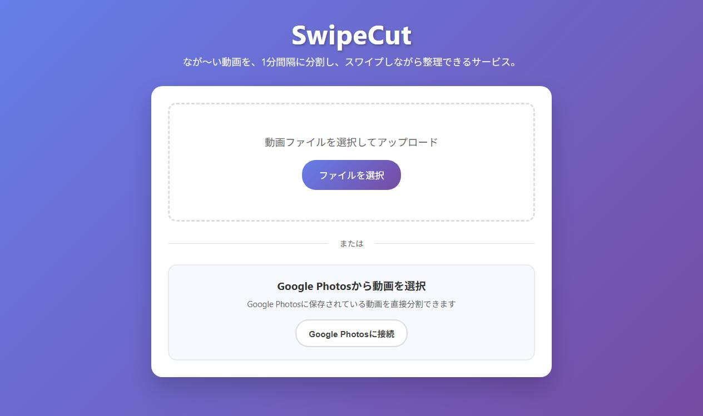
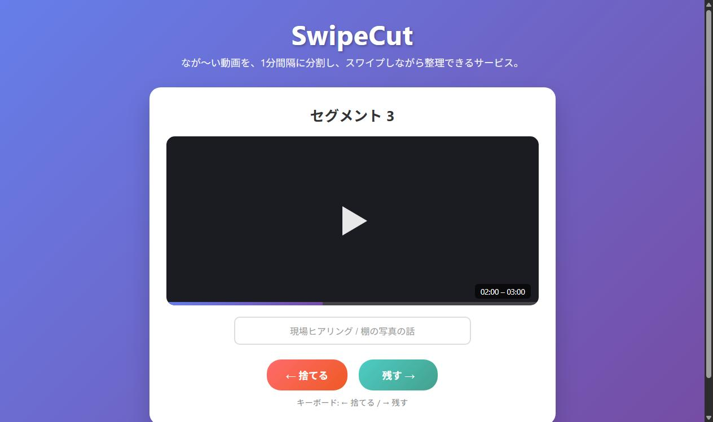
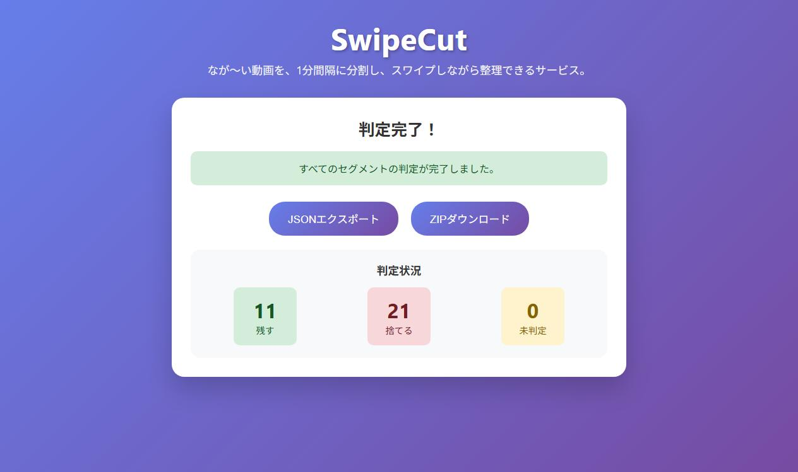

奥山といいます。就活の事務を自動化するOSS[katazuku-shukatsu](https://github.com/kokotatan/katazuku-shukatsu)を作っている、地方大学の理系院生です。

この記事は、その前に作った小さなツール[SwipeCut](https://github.com/kokotatan/swipecut)の記録です。

自分にとってこれは、AIと一緒に作って、実際に人へ配った最初の実用ツールでした。うまくいったかというと、正直あまり使われませんでした。今となっては「これ、AIがそのまま自動でやってくれるよね」とも思います。それでも、課題の見つけ方と、作らない判断の話として残しておきたいと思いました。

## きっかけは、ヒアリングの動画整理だった

当時、いろいろな現場へヒアリングに行っていました。

話を聞いて、様子を動画で撮って、あとでチームに共有する。よくあるやり方です。

ただ、この「あとで共有する」が地味に大変でした。

撮った動画は長い。全部を送っても誰も最後まで見ません。かといって、必要なところだけを切り出そうとすると、動画編集ソフトを開いて、タイムラインをスクラブして、いる/いらないを判断して、書き出す。数分の動画のために、その往復をやることになります。

一本ならまだしも、現場ごとに何本もたまります。

問題は、一つひとつの判断が難しいわけではないことでした。「この1分はいる」「ここはいらない」。見れば数秒で決まります。大変なのは、その判断を動画編集という重い操作に乗せ換えることのほうでした。

## 「編集」をやめて、「仕分け」にする

そこで発想を変えました。

きれいに編集するのをやめて、まず機械的に1分ごとに分割してしまう。あとは、出てきた断片を1つずつ見て、「残す/捨てる」だけ決める。

判断を、編集ではなく仕分けにする。しかもその仕分けを、いちばん軽いUIに寄せる。

思いついたのがTinderのスワイプでした。カードが1枚出てきて、右か左に振るだけ。動画の断片にも、これがそのまま使えます。左で捨てる、右で残す。キーボードの矢印でも振れる。残すものにだけ、あとで探せるように短い名前をつける。

最後に、残したものだけをZIPでまとめて落とす。

編集ソフトの「全部できるけど重い」に対して、「残すか捨てるかしかできないけど速い」を作ろう、というのが最初の設計でした。

## どう動くか

3画面だけです。

まず、動画を渡します。ファイルを選ぶか、Google Photosから直接持ってきます。渡すと、裏で1分ごとに分割されます。



次に、断片が1枚ずつ出てきます。見て、左右で「捨てる/残す」を決めます。残すものには名前をつけます。矢印キーだけでどんどん振れます。



全部振り終わると、残した断片の数と、捨てた数が出ます。あとはJSONで一覧を出すか、ZIPで残したものだけまとめて落とします。



## 中身

構成はシンプルです。

- バックエンド: FastAPI + FFmpeg + SQLite（SQLAlchemy）
- フロントエンド: React + Vite
- デプロイ: Railway（FFmpegが動く必要があるので、その前提で選定）

分割は`ffmpeg`にやらせます。アップロードされた動画を`chunk_sec=60`で切り、各セグメントをDBに登録します。フロントは「次の未判定セグメントをくれ」→「この判定を保存」を繰り返すだけの薄いループです。

```text
POST /api/upload?chunk_sec=60      動画を受け取って1分ごとに分割
GET  /api/next_segment?video_id    次の未判定セグメントを返す
POST /api/decide?segment_id&decision=keep|drop   判定を保存
POST /api/name?segment_id&name     残すセグメントに名前をつける
GET  /api/export_zip?video_id      keepだけをZIPで返す
```

判定はセグメント単位でDBに持たせているので、途中でブラウザを閉じても、次に開けば未判定の続きから戻れます。状態を全部フロントのメモリに載せると、リロードで最初からになります。動画の仕分けは件数が多いので、そこは早い段階でサーバ側に寄せました。

少し凝ったのはGoogle Photos連携です。撮った動画はたいていスマホからGoogle Photosに入っています。ローカルに落としてから渡すのは一手間なので、OAuthで認証して、Google Photosの動画一覧から直接「分割開始」できるようにしました。

## 正直な結果

このツール、あまり使われませんでした。

理由はいくつか思い当たります。動画を渡してサーバで分割する構成は、長い動画だとアップロードと分割の待ちが出ます。手元で完結しないので、気軽さがそこで少し落ちる。そして何より、「動画を細かく仕分けたい」という場面が、自分が思ったほど日常には多くありませんでした。

課題そのものは本物でした。でも、それが「毎日起きる」のか「たまに起きる」のかを、作る前にちゃんと見ていませんでした。作ってから、頻度が足りないことに気づいた、という順番です。

## 今なら、たぶんAIがそのままやる

作ったあとで、状況も変わりました。

いまのモデルは、長い動画をそのまま読んで「ここが要点」「ここはいらない」を言えるようになってきています。人が1分ごとに全部見て振らなくても、「この現場ヒアリングから、意思決定に効く部分だけ3分に」と頼めば、近いことができそうです。

SwipeCutは、人間の判断（残す/捨てる）を、いちばん軽いUIに寄せる道具でした。その「人間が全部見て振る」ところ自体を、AIが肩代わりし始めている。自分が手で作った仕分けUIが、モデルの進化で要らなくなっていく側にある、というのは面白い体験でした。

## それでも作ってよかったこと

うまくいかなかった話ばかり書きましたが、自分にとっては意味のある一本でした。

- 「編集」という重い操作を、「仕分け」という軽い判断に置き換える、という設計の型を最初に試せた
- FFmpegでの分割、FastAPIの薄いAPI、状態をサーバに持たせて中断復帰する、という構成を通しで作れた
- そして、AIと一緒に作ったものを、自分以外の人に配って使ってもらおうとした最初の経験だった

このあと作った[katazuku-shukatsu](https://github.com/kokotatan/katazuku-shukatsu)では、「人間には最後の判断だけ残す」「状態はちゃんと正本に持たせて中断から戻す」という考えを、もっと真剣にやっています。その原型は、この小さな動画ツールで一度触っていたのだと思います。

リポジトリはこちらです。

https://github.com/kokotatan/swipecut

作らない判断も含めて、誰かの参考になればうれしいです。
