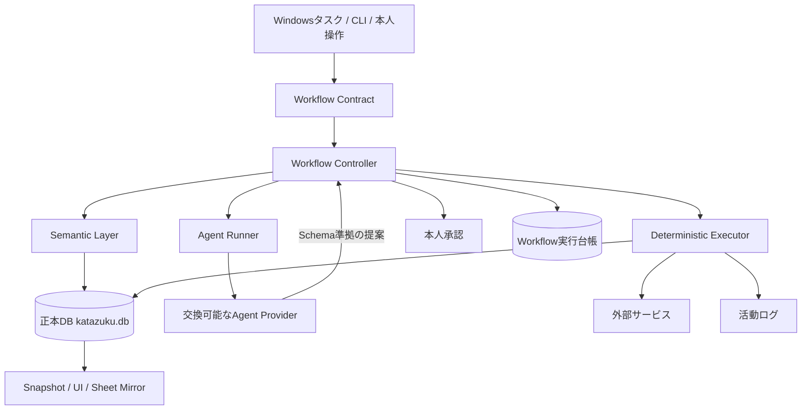

# Spec 17: セマンティック制御とワークフロー実行契約

最終更新: 2026-08-24

## 1. 目的

katazukuは、就職活動に伴うメール確認、予定管理、選考情報の更新、企業研究、応募準備を自動化する個人用システムである。利用者本人が担当するのは、考えること、選考を受けること、認証すること、第三者へ何を確定するか決めることである。

本仕様は、エージェントが扱う事実、判断、権限、処理順序をコードで制御するための最終アーキテクチャを定義する。モデルのプロンプト遵守や自己申告だけに安全性を依存させず、次の事故を実行基盤で防ぐ。

- 複製DBやテストDBを正本と誤認して外部操作を行う
- 同期できていない期間を「予定なし」と解釈する
- エージェントが推測を事実としてDBへ保存する
- 読み取り処理からDB更新や第三者への送信が行われる
- 承認後に宛先、本文、日時、通知内容が変更される
- 障害後の再実行で応募、予約、送信を重複させる
- モデルや実行providerの変更によって業務規則が変わる

モデル非依存のprovider選択、障害分類、フォールバックは[Spec 14](./14-provider-independent-agent-runtime.md)が扱う。本仕様は、その実行役が担当できる工程と、工程の前後で強制する業務上の安全境界を扱う。

## 2. 設計原則

1. **正本は一つにする。** 就活情報の正本はSQLite DBとし、画面、スプレッドシート、モデルの会話履歴を判断根拠の正本にしない。
2. **事実、提案、確定操作を分離する。** 外部から得た事実、モデルが作った候補、DBまたは第三者へ反映する操作を別の型と工程で扱う。
3. **不明を成功へ丸めない。** 同期不全、根拠不足、結果確認不能は`unknown`として停止する。
4. **モデルに副作用を持たせない。** エージェントは読み取りと構造化提案だけを担当し、書き込みは決定論的なExecutorだけが行う。
5. **権限は工程ごとに最小化する。** ワークフロー全体へ広い権限を渡さず、実行中の一工程に必要なcapabilityだけを渡す。
6. **承認は操作全体に結び付ける。** 本人が見た内容と、Executorが実行する内容が完全一致する場合だけ第三者への確定操作を許可する。
7. **再実行を前提にする。** run、入力、外部ID、工程を記録し、同じ処理が繰り返されても二重反映しない。
8. **安全規則をproviderから独立させる。** Claude、Codex、ローカルモデルのどれを使っても、同じSchema、遷移規則、承認規則、冪等性を適用する。

## 3. 全体構成



各構成要素の責務は次のとおりである。

| 要素 | 責務 | 禁止事項 |
|---|---|---|
| Trigger | 実行開始、入力参照、run IDの発行 | 業務判断、DB直接更新 |
| Workflow Contract | 工程順、担当、権限、副作用、Schema、承認、冪等性の宣言 | provider固有ツール名の記述 |
| Workflow Controller | 契約検証、状態遷移、DB同一性固定、承認照合、実行台帳 | メール内容などの推論 |
| Semantic Layer | 正本DBから根拠付きの業務状態を返す | 不明状態の補完、外部副作用 |
| Agent | 事実抽出、分類、要約、構造化提案 | DB書き込み、送信、予約確定、自由なSQL |
| Executor | Schema検証済み提案の反映、外部操作、冪等化 | モデル的な推測、契約外の工程実行 |
| User | 認証、本人確認、第三者への確定操作の判断 | システム内部の自動処理を手動で追跡すること |

## 4. 正本DBとデータの同一性

### 4.1 DBパスの解決

すべてのスクリプトは`resolveDatabasePath()`を使用し、次の優先順位でDBを一度だけ解決する。

1. CLIなどから渡された明示パス
2. `KATAZUKU_DB`
3. 互換用の`KATAZUKU_DB_PATH`
4. リポジトリ内の`data/katazuku.db`

各処理が独自に相対パスや環境変数を解釈してはならない。解決済みDB接続または`DatabaseContext`を下流へ渡し、工程の途中で再選択しない。

### 4.2 論理IDと実行時role

`database_identity.database_id`はDB自身が持つ論理IDである。バックアップや複製後も同じデータ系列であることを識別できる。一方、roleはファイル固有の値ではなく、その実行環境での役割である。

| role | 用途 | 外部確定操作 |
|---|---|---|
| `canonical` | 唯一の正本 | 条件を満たす場合のみ可 |
| `replica` | 閲覧、バックアップ、復旧確認 | 不可 |
| `fixture` | テスト、メモリDB | 不可 |

ワークフロー開始時に`database_id`、role、絶対パス、Schema versionを取得する。実行台帳には少なくとも`database_id`、role、絶対パスを固定し、以後の工程が一つでも異なるDBを示した場合は拒否する。同じ`database_id`を持つ複製でも、roleまたはパスが異なれば別の実行対象として扱う。

## 5. セマンティック層

セマンティック層は、モデルが生のテーブルを読みながら業務ルールを毎回推測する状態をなくす。正本DBと同期状態を読み、判断理由を含む型付き結果を返す。モデルはその結果を説明や提案に利用できるが、判定規則を上書きできない。

### 5.1 事実、提案、操作

処理対象は次の三種類に分ける。

| 種類 | 例 | 保存・実行方法 |
|---|---|---|
| Fact | メールID、面接日時、企業名、提出結果 | 根拠ref付きで正本DBへ保存 |
| Proposal | 選考段階の候補、返信案、人物情報の候補 | JSON Schemaで検証し、必要に応じて`pending_review`や候補テーブルへ保存 |
| Action | DB更新、下書き作成、予約確定、メール送信 | Executorが契約、冪等性、承認を検証して実行 |

根拠のない推測をFactとして保存してはならない。確定情報と競合する候補は既存値を上書きせず、確認対象として残す。

### 5.2 予定の二層モデル

`appointment`と`schedule_block`は目的が異なるため統合しない。

- `appointment`: 面接、面談、説明会、締切など、就活上の意味を持つ予定。`selection`に属し、企業、選考段階、会議URL、相手などを保持する。
- `schedule_block`: 空き判定専用の占有投影。大学、研究、私用、終日予定、移動を含み、企業や選考トラックを必要としない。

Google Calendar同期は、一回の処理で次を行う。

1. 就活予定を`appointment`へ外部IDをキーとしてupsertする。
2. busyとして扱う全予定を`schedule_block`へ投影する。
3. provider、アカウント、カレンダー、外部イベントIDの組で冪等化する。
4. アカウントごとの取得成否、取得範囲、試行時刻、成功時刻を`source_sync_state`へ記録する。
5. 全件取得に成功した範囲に限り、外部側から消えた占有を`cancelled`へ変更する。partialまたはfailedでは削除扱いにしない。

### 5.3 空き判定

空き判定APIは`available`、`conflict`、`unknown`の三値を返す。

| state | 条件 | 確定操作 |
|---|---|---|
| `conflict` | 既知の予定、移動、前後バッファのいずれかと重なる | 不可 |
| `unknown` | 衝突は見つからないが、情報の完全性を証明できない | 不可 |
| `available` | 正本DB、同期成功、鮮度、期間被覆を満たし、衝突がない | 本人承認など残りの条件を満たせば可 |

判定規則は次のとおりである。

- `canonical`以外のDBでは`available`を返さない。
- Google Calendarの同期実績がない、失敗または部分成功、最終成功から10分を超過、候補日時が取得範囲外のいずれかなら`unknown`とする。
- `schedule_block`、未完了の`appointment`、`travel_segment`をすべて照合する。
- 対面予定の移動バッファ、オンライン予定の準備時間を実占有時間へ加える。
- 既知の衝突が一件でもあれば、同期状態にも問題がある場合でも安全側の`conflict`を返す。
- `available`を使えるのは、`state === "available"`、`available === true`、`database.role === "canonical"`が同時に成立する場合だけである。

外部サイトで面接、面談、説明会などの日程を確定する直前には、Calendar同期を実行し、同じ正本DBに対して候補時間の空き判定を再実行する。画面表示、会話要約、過去の空き判定結果で代用しない。

## 6. ワークフロー契約

ワークフローは「エージェントを一回呼ぶ処理」ではなく、担当と安全境界が固定された直線的な工程列として定義する。Schema version 1では各工程の`next`は一つであり、終端だけ`null`とする。

契約ファイルは`sync/workflows/*.json`、共通Schemaは`sync/schemas/workflow-contract.schema.json`に置く。

### 6.1 契約項目

| 項目 | 意味 |
|---|---|
| `id`, `version` | ワークフローの識別子と契約版 |
| `database.requiredRole` | `canonical`限定または任意role |
| `firstStep` | 開始工程 |
| `steps[].owner` | `trigger`、`executor`、`agent`、`user` |
| `steps[].sideEffect` | 副作用の種類 |
| `steps[].capabilities` | その工程だけに与える論理権限 |
| `inputSchema`, `outputSchema` | 工程入出力のJSON Schema |
| `approval` | 本人承認の要否 |
| `requiresApprovalFrom` | 第三者確定操作が参照する承認工程 |
| `idempotency` | 冪等化方式 |
| `next` | 次工程または終端 |

副作用は次の五種類に限定する。

| sideEffect | 例 |
|---|---|
| `none` | 読み取り、抽出、検証 |
| `db-write` | 正本DBへの反映 |
| `external-draft` | メール下書き、未確定の外部候補作成 |
| `internal-sync` | snapshot、mirror、活動ログ |
| `third-party-commit` | 送信、応募、予約確定、取消、変更通知 |

冪等化方式は次の三種類である。

- `not-applicable`: 本人判断など、機械的な再実行を行わない。
- `run-step`: 同じrunの同じ工程を一回だけ完了させる。
- `external-key`: メールID、イベントID、submission ID、run IDなど、安定した外部キーで重複を防ぐ。

### 6.2 契約の静的検証

Workflow Controllerは実行前に、少なくとも次を拒否する。

- 未知フィールド、重複step ID、存在しない遷移先、循環、到達不能工程
- Agent工程に`sideEffect !== none`が設定されている
- Agent工程に`outputSchema`がない
- User工程に`approval: user`または`inputSchema`がない
- Executor以外の工程が副作用を持つ
- `third-party-commit`に先行するUser承認工程がない
- 存在しないSchemaファイルを参照している

契約のタイプミスを黙って無視してはならない。安全境界に関する未定義値は、すべて実行停止にする。

## 7. 実行台帳と状態機械

実行制御の台帳は`logs/workflow-runtime.local.db`に保存し、業務正本DBから分離する。台帳はgit、snapshot、アプリ配信用データへ含めない。

### 7.1 run開始時に固定する値

run開始時に次をcanonical JSONへ正規化し、SHA-256または実値を記録する。

- workflow ID、version、契約全体のhash
- run ID、入力hash
- 対象DBの`database_id`、role、絶対パス
- 最初のstep ID

同じrun IDで再開できるのは、契約、入力、対象DBがすべて一致する場合だけである。契約変更後に既存runを新契約で継続したり、同じrun IDへ異なる入力を混ぜたりしてはならない。

### 7.2 状態

runは`running / needs_user / done / failed / unknown`を持つ。stepは`pending / running / needs_user / succeeded / failed / unknown`を持つ。

```text
pending
  ├─ begin ─> running ─> succeeded ─> 次step
  │                    ├> failed
  │                    └> unknown
  └─ approval request ─> needs_user ─> succeeded / failed

終端stepがsucceededになったときだけrunをdoneにする。
```

- `failed`はSchema違反、業務規則違反、本人の拒否など、失敗が確定した状態である。
- `unknown`は同期範囲不足、タイムアウト、外部結果を確認できない状態など、成功とも失敗とも断定できない状態である。
- `unknown`を`done`へ変換してはならない。外部状態の再取得、reconcile、または本人確認で根拠を得てから、新しい安全な工程として続行する。
- 完了済みstepを先頭から再実行しない。副作用工程は外部キーと現在状態を照合してから再開する。

## 8. エージェント工程

エージェントは、Runnerが契約から生成した実行条件の中でのみ動作する。

1. Controllerが現在step、owner、capabilities、出力Schemaを取得する。
2. Agent用wrapperが`begin`を実行し、契約と完全一致するcapabilityだけをRunnerへ渡す。
3. Runnerがcapabilityを満たすproviderを選ぶ。
4. Agentは読み取った事実からSchema準拠のJSONを一つ返す。
5. Controllerが出力Schemaを再検証し、hashと参照先を台帳へ記録する。
6. 検証成功後にだけ次のExecutor工程へ進む。

Agent工程は、SQL、DB更新、Gmailラベル変更、下書き、送信、Calendar更新を実行しない。プロンプトに禁止事項を書くことに加え、Runnerのtool allowlist、capability map、外部サービスbridgeで物理的に権限を狭める。

## 9. Executor工程

Executorはモデル出力をそのまま命令として実行しない。次の順序を固定する。

1. JSON Schemaを検証する。
2. source ref、外部ID、日時形式、列挙値などの業務規則を検証する。
3. 現在step、owner、対象DB、必要承認、冪等キーを照合する。
4. `db-apply-*`、`transition()`、専用APIなど許可された関数だけで反映する。
5. トランザクションまたは外部IDで重複を防ぐ。
6. 結果を再取得し、成功を確認する。
7. DB書き込み後はsnapshotを更新し、活動ログへ「何を、何のために、どうしたか」を残す。

汎用のSQL生成や、モデルが指定した任意コマンドをExecutorとして扱ってはならない。

## 10. 第三者への確定操作

採用担当者、面接官、企業サイトなど第三者へ影響する操作は、重要度や定型性にかかわらず自動確定しない。対象にはメール送信、フォーム送信、面接予約、日程回答、取消、変更通知を含む。

### 10.1 承認対象

承認画面には`third-party-action.schema.json`に従い、少なくとも次を本人へそのまま提示する。

- `actionType`: 送信、予約、取消などの操作種別
- `target`: 宛先、企業、サイト、対象イベント
- `content`: 件名、本文、回答、選択内容
- `effectiveAt`: 確定日時または実行タイミング
- `notification`: 実行によって誰に何が通知されるか

メールではTo、CC、BCC、件名、本文を省略しない。日程操作では確定する開始・終了日時、タイムゾーン、場所またはURL、相手への通知内容を省略しない。

### 10.2 hashによる結合

1. 提示するAction全体をキー順で正規化したcanonical JSONへ変換する。
2. SHA-256を計算し、`requested`としてrunと承認stepへ保存する。
3. 本人は同じActionに対して`approved`または`rejected`を返す。
4. 確定Executorは開始時と完了時にActionを再hashする。
5. 承認hashと完全一致した場合だけ実行し、成功後に承認を`consumed`へ変更する。

宛先、本文、日時、通知内容のどれか一つでも変われば別Actionとして再提示する。過去の承認、包括的な依頼、別runの承認、すでに`consumed`になった承認を再利用しない。

### 10.3 外向き通信の防御

通常のAgent実行経路ではGoogle Workspace操作を論理capabilityで分離する。

- `gmail.read`: 検索、取得
- `gmail.draft`: 下書き作成
- `gmail.labels`: ラベル変更、既読化
- `gmail.send.self`: 本人自身への通知送信

Google Workspace bridgeは、契約外capabilityのtool callを拒否する。`send_gmail_message`はTo、CC、BCCの全宛先をコードで検査し、本人以外または宛先不明なら拒否する。第三者への確定送信は、この無人Agent経路を通さず、承認hashを検証する専用Executorまたは本人操作で実行する。

## 11. 障害、再試行、provider切替

失敗時の扱いは副作用の有無で決める。

| 状況 | 扱い |
|---|---|
| Agent出力確定前のprovider障害 | 同じ入力とSchemaで別providerへ切替可能 |
| Schema不一致 | 副作用なし。規定回数だけ再生成可能 |
| DBトランザクション失敗 | rollbackし、同じ外部キーを使って再試行可能 |
| 外部下書き後の中断 | 外部IDを再取得し、存在を照合してから続行 |
| 第三者確定操作中のタイムアウト | `unknown`で停止。送信済み・予約済みか再取得するまで再実行禁止 |
| CAPTCHA、MFA、OAuth同意 | `needs_user`で停止し、KOKOTATANPCのChromeへ引き継ぐ |

副作用開始後に別providerでワークフローを先頭から実行し直さない。外部状態を照合できる操作は`reconcile`し、照合手段がない操作は同じrunのcheckpointと本人確認から再開する。

## 12. 機密情報と監査

- 認証情報はcredential brokerから実行直前に取得し、プロンプト、台帳、ログ、URL、ソースへ保存しない。
- メール本文、個人情報、承認Actionなどを含む実行成果物は`*.local.*`または`logs/`へ置き、gitとsnapshotから除外する。
- Workflow台帳には状態、hash、参照先、エラー要約を保存する。業務正本の代わりとして使わない。
- `schedule_block`は私用予定を含むためsnapshotへ出さない。
- 住所、移動履歴、人物写真本体もsnapshotへ出さない。
- DB更新後は`db-snapshot.ts`を実行し、活動ログへ目的と結果を記録する。

## 13. daily-syncの契約例

メールから選考情報を更新する`daily-sync`は、次の工程だけで構成する。

```text
prepare
  -> extract      Agent / gmail.read / 副作用なし / 厳格JSON
  -> validate     Executor / Schema・業務規則検証
  -> apply        Executor / 正本DB更新 / 外部キーで冪等
  -> snapshot     Executor / アプリ反映・DBバックアップ
  -> audit        Executor / 活動ログ
  -> done
```

`extract`だけがAgent工程である。モデルはGmailを読み、`daily-sync-result.schema.json`に一致する抽出結果を返す。`daily-sync-apply.ts`が同じSchemaと業務規則を再検証し、専用apply関数を一つのDB接続で実行する。モデルの種類にかかわらず、DB遷移と重複排除の結果は同じになる。

既読化、ラベル変更、下書き、送信は抽出と同じ工程へ混ぜない。それぞれ別の副作用工程として契約し、必要なcapability、冪等キー、承認条件を個別に定義する。

## 14. 適用単位

すべての定常処理を一度に巨大な契約へまとめない。外部入力、正本DB更新、外部副作用の境界ごとにワークフローを分ける。

| ワークフロー | Agentの役割 | Executorの役割 | 主要な停止条件 |
|---|---|---|---|
| daily-sync | Gmailから事実を抽出 | DB反映、snapshot、監査 | Schema不一致、正本DB不一致 |
| calendar-sync | Calendar結果の構造化補助が必要な場合のみ使用 | appointment・schedule_block・同期状態のupsert | partial、鮮度切れ、期間外 |
| mail-watch | 新着の分類、返信要否の提案 | 台帳反映、必要なら下書き | 第三者送信前 |
| asa | 今日の予定とタスクの要約 | 正本DBからagenda生成 | 根拠不足、同期不全 |
| application | フォーム項目の対応案、入力候補 | サイト別入力、checkpoint、結果記録 | 送信、テスト、本人確認 |
| appointment booking | 候補日時と必要情報の整理 | 直前同期、空き判定、承認後の確定 | `conflict`、`unknown`、未承認 |

## 15. 実装の対応関係

| 責務 | 実装 |
|---|---|
| DBパス統一 | `sync/src/database-path.ts` |
| DB identityとrole | `sync/src/db.ts`、`sync/src/platform.ts` |
| 予定投影と三値判定 | `sync/src/schedule.ts` |
| Workflow契約Schema | `sync/schemas/workflow-contract.schema.json` |
| Workflow状態機械 | `sync/src/workflow-control.ts` |
| 非対話CLI | `sync/scripts/workflow-control.ts` |
| Agent工程wrapper | `scripts/invoke-workflow-agent.ps1` |
| Workspace最終防壁 | `scripts/workspace-mcp-policy.mjs`、`scripts/workspace-mcp-bridge.mjs` |
| daily-sync契約 | `sync/workflows/daily-sync.json` |
| 第三者Action Schema | `sync/schemas/third-party-action.schema.json` |
| 契約回帰試験 | `sync/scripts/check-workflow-control.ts` |

## 16. 受け入れ条件

この設計に準拠するワークフローは、次を自動試験で証明しなければならない。

1. Agent工程へ副作用を設定した契約を読み込めない。
2. 契約外capabilityを追加または省略してAgentを起動できない。
3. 工程順、owner、契約versionを実行途中で変更できない。
4. 同じrun IDへ異なる入力または異なるDBを混ぜられない。
5. `canonical`専用ワークフローを`replica`または`fixture`で開始できない。
6. Agent出力と承認入力がJSON Schemaに一致しなければ次工程へ進めない。
7. Calendar同期失敗、鮮度切れ、期間外を`available`へ変換しない。
8. 既知の予定、移動、前後バッファを衝突として検出する。
9. 承認後にActionの一項目でも変更すると確定操作を開始できない。
10. 承認と完全一致する確定操作だけが承認を`consumed`にし、runを`done`にできる。
11. 結果不明の副作用を`unknown`で停止し、自動的に成功扱いまたは再送しない。
12. DB更新後にsnapshotと活動ログが完了しなければ、ワークフロー全体を完了扱いにしない。

上記はプロンプト上の推奨事項ではなく、契約検証、状態機械、Schema、DB制約、外部サービスbridge、回帰試験で強制する。
